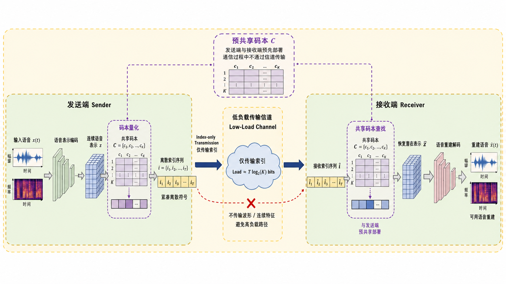

# 论文图片生成提示词

本文档从 `paper_outline_low_load_semantic_speech.md` 中单独抽取图片生成提示词，便于复制到 image2/image2pro 等工具中使用。

### 11.1 Figure 2：Overall Architecture

当前 Figure 2 图片素材：



素材路径：

- 当前 MD 相对路径：`论文素材/figure2参考示例图.png`
- 仓库相对路径：`output/doc/论文素材/figure2参考示例图.png`

用途说明：这是 image2 生成的 Figure 2 初版/参考稿，用于表现“发送端 -> 低负载索引信道 -> 接收端”的整体框架，以及共享码本在发送端和接收端预部署、不经信道传输的核心机制。后续正式使用前需要检查图中文字、数学符号、模块命名和排版清晰度。

### 11.2 Figure 2 图片生成提示词

Figure 2 中文图片生成提示词：

```text
请参考输入示例图的学术论文系统示意图风格，生成一张“基于共享码本索引传输的低负载语音语义通信框架”图片。

重要风格要求：
- 不是普通流程图，不要只画一排矩形框。
- 要像通信/深度学习论文中的系统架构图。
- 使用浅绿色或浅米色的大背景面板。
- 使用黄色虚线边框表示系统区域。
- 使用紫色虚线小框突出关键模块。
- 模块之间用粗箭头连接。
- 用堆叠的特征图、张量块、码本矩阵、索引小方块来表示数据形态。
- 整体横向布局，16:9。
- 风格类似 IEEE / Nature Communications 论文插图。
- 扁平化 2.5D 科研插图风格。
- 颜色柔和，线条清晰，文字可读。
- 不要炫酷科技风，不要霓虹，不要复杂背景。

整体布局：
从左到右分为三个区域：
1. 发送端 Sender
2. 低负载传输信道 Low-Load Channel
3. 接收端 Receiver

在最外层画一个浅米色大圆角背景，使用黄色虚线边框包围整个系统。

发送端区域：
标题写：发送端 Sender

发送端内部从左到右画以下内容：

1. 输入语音
- 用一个小的语音波形图或声谱图表示。
- 标注：输入语音 x(t)

2. 语音语义特征提取
- 用一组堆叠的神经网络特征图表示，不要画简单矩形。
- 标注：语音表示编码
- 输出一个连续特征张量。
- 标注：连续语音表示 z

3. 码本量化
- 画一个紫色虚线框，里面是一个码本矩阵或多行多列的 embedding table。
- 标注：码本量化
- 旁边画一个共享码本矩阵。
- 标注：共享码本 C = {c1, c2, ..., cK}

4. 离散索引序列
- 用一串小方块或小 token tiles 表示。
- 每个小方块里可以写 i1, i2, i3, ...
- 标注：离散索引序列 i = {i1, i2, ..., iT}
- 在下方标注：紧凑离散符号

中间信道区域：
标题写：低负载传输信道 Low-Load Channel

画一个云状或浅色通道模块，里面写：
仅传输索引
Load ≈ T log2(K) bits

从发送端的离散索引序列到信道画粗箭头，箭头上写：
Index-only Transmission

在信道下方用淡红色虚线画一个被叉掉的路径，标注：
不传输波形 / 连续特征
避免高负载路径

接收端区域：
标题写：接收端 Receiver

接收端内部从左到右画以下内容：

1. 接收索引序列
- 用一串小 token tiles 表示。
- 标注：接收索引序列 i_hat

2. 共享码本查找
- 画一个紫色虚线框，里面是同样风格的码本矩阵。
- 标注：共享码本查找
- 用虚线连接到上方或旁边的共享码本，表示发送端和接收端共享同一码本。
- 标注：码本预部署，不经信道传输

3. 恢复潜在表示
- 用一组堆叠特征图表示。
- 标注：恢复潜在表示 z_hat

4. 语音重建解码器
- 用一组反向的神经网络特征图或解码器 block 表示。
- 标注：语音重建解码

5. 重建语音
- 用一个语音波形图或声谱图表示。
- 标注：重建语音 x_hat(t)
- 下方标注：可用语音重建

共享码本设计：
在发送端和接收端之间画一个醒目的共享码本模块，使用紫色边框或紫色虚线框。
标题：预共享码本 C

内部文字：
发送端与接收端预先部署
通信过程中不通过信道传输

用紫色虚线分别连接：
- 发送端的码本量化模块
- 接收端的共享码本查找模块

视觉重点：
- 让“离散索引序列”和“共享码本”成为图中的核心视觉重点。
- 让信道中只传输索引这一点非常明显。
- 图像整体应像科研论文中的系统架构图，而不是产品流程图。

不要出现：
- 不要出现 SpeechTokenizer。
- 不要出现具体已有模型名称。
- 不要出现人物、机器人、卫星、量子粒子。
- 不要画成普通商业流程图。
- 不要使用大面积深色背景。
- 不要使用霓虹蓝紫科技风。
- 不要添加无关装饰图标。

最终图片应清楚表达：
输入语音先被编码为连续语音表示；
连续表示通过共享码本量化为离散索引；
通信信道中只传输离散索引；
共享码本在发送端和接收端预先部署，不通过信道传输；
接收端通过码本查找和语音重建恢复语音；
该框架通过索引级传输降低语音通信负载。
```

Figure 2 English image generation prompt:

```text
Use the provided reference image only as a visual style reference: an academic semantic communication architecture diagram with light system panels, dashed module boundaries, tensor-like feature blocks, and a left-to-right transmission structure. Do not copy its image content.

Generate an academic system architecture figure titled “Low-Load Semantic Speech Communication via Shared Codebook Index Transmission”.

Important style requirements:
- This should not look like a simple business flowchart.
- Do not draw only a row of plain rectangles.
- Make it look like a communication/deep-learning paper architecture diagram.
- Use a light green or light beige system background panel.
- Use yellow dashed borders to indicate system regions.
- Use purple dashed boxes to highlight key modules.
- Connect modules with thick arrows.
- Use stacked feature maps, tensor blocks, codebook matrices, and small index token tiles to represent data forms.
- Use a horizontal 16:9 layout.
- Use an IEEE / Nature Communications style scientific illustration.
- Use a flat 2.5D research-diagram style.
- Use soft colors, clear lines, and readable text.
- Avoid futuristic neon style, complex background, and decorative visual effects.

Overall layout:
Divide the figure from left to right into three regions:
1. Sender
2. Low-Load Channel
3. Receiver

Draw a large rounded light beige outer panel around the whole system, with a yellow dashed border.

Sender region:
Title: Sender

Inside the Sender region, draw the following components from left to right:

1. Input speech
- Represent it using a small waveform or spectrogram icon.
- Label: Input Speech x(t)

2. Speech semantic feature extraction
- Represent it using stacked neural feature maps, not a plain rectangle.
- Label: Speech Representation Encoding
- Output a continuous feature tensor.
- Label: Continuous Speech Representation z

3. Codebook quantization
- Draw a purple dashed box containing a codebook matrix or embedding table.
- Label: Codebook Quantization
- Place a shared codebook matrix nearby.
- Label: Shared Codebook C = {c1, c2, ..., cK}

4. Discrete index sequence
- Represent it using a sequence of small token tiles.
- Each tile may contain i1, i2, i3, ...
- Label: Discrete Index Sequence i = {i1, i2, ..., iT}
- Add a small annotation: Compact discrete symbols

Central channel region:
Title: Low-Load Channel

Draw a cloud-like or light channel module containing:
Index-only transmission
Load ≈ T log2(K) bits

Draw a thick arrow from the discrete index sequence to the channel. Label the arrow:
Index-only Transmission

Below the channel, draw a faint red dashed crossed-out path labeled:
No waveform / continuous feature transmission
High-load path avoided

Receiver region:
Title: Receiver

Inside the Receiver region, draw the following components from left to right:

1. Received index sequence
- Represent it using small token tiles.
- Label: Received Index Sequence i_hat

2. Shared codebook lookup
- Draw a purple dashed box containing a codebook matrix in the same visual style.
- Label: Shared Codebook Lookup
- Connect it with a dashed line to the shared codebook to indicate the same codebook is available at both ends.
- Add the note: Pre-deployed codebook, not transmitted through the channel

3. Recovered latent representation
- Represent it using stacked feature maps.
- Label: Recovered Latent Representation z_hat

4. Speech reconstruction decoder
- Represent it using reverse neural feature maps or decoder blocks.
- Label: Speech Reconstruction Decoding

5. Reconstructed speech
- Represent it using a waveform or spectrogram icon.
- Label: Reconstructed Speech x_hat(t)
- Add a small annotation: Usable speech reconstruction

Shared codebook design:
Place a prominent shared codebook module between the Sender and Receiver sides, using a purple border or purple dashed box.
Title: Pre-shared Codebook C

Inside the module, write:
Pre-deployed at both sender and receiver
Not transmitted through the channel

Use purple dashed lines to connect it to:
- The Codebook Quantization module on the Sender side
- The Shared Codebook Lookup module on the Receiver side

Visual emphasis:
- Make “Discrete Index Sequence” and “Shared Codebook” the core visual focus.
- Make it very clear that only indices are transmitted through the channel.
- The overall image should look like a scientific paper system architecture diagram, not a product workflow diagram.

Do not include:
- Do not mention SpeechTokenizer.
- Do not mention any specific existing model names.
- Do not include people, robots, satellites, or quantum particles.
- Do not make it look like a generic business flowchart.
- Do not use a dark background.
- Do not use neon blue-purple futuristic styling.
- Do not add irrelevant decorative icons.

The final figure should clearly show:
Input speech is encoded into a continuous speech representation.
The continuous representation is quantized into discrete indices using a shared codebook.
Only the discrete indices are transmitted through the communication channel.
The shared codebook is pre-deployed at both sender and receiver and is not transmitted through the channel.
The receiver reconstructs speech using codebook lookup and speech reconstruction.
The framework reduces speech communication load through index-level transmission.
```

### 11.3 Figure 3 图片生成提示词：Transmitter-Side Continuous Representation Encoder

Figure 3 中文图片生成提示词：

```text
生成一张学术论文风格的模型架构图，主题为“发送端连续语音表示编码模块”。

图像用途：
这是论文中的 Figure 3，用于解释发送端如何将输入语音波形编码为连续潜在表示 Z。该图不是整体通信框架图，也不是完整收发端系统图，只展示发送端编码器内部从 x(t) 到 Z 的过程。

整体风格：
- 学术论文插图风格，适合 IEEE / Nature Communications
- 扁平化 2.5D 科研架构图
- 白色或浅米色背景
- 使用浅蓝色作为发送端编码模块主色
- 使用紫色或深蓝色突出连续潜在表示 Z
- 使用堆叠特征图、卷积块、下采样箭头、时序特征张量来表示模型结构
- 不要画成普通流程图，不要只画一排矩形框
- 线条清晰，文字简洁，可读性强
- 横向 16:9 构图

图内不要放标题：
- 不要在图片顶部添加“发送端连续表示编码架构”。
- 不要在图片顶部添加“Transmitter-Side Continuous Representation Encoder”。
- 图名后续放在论文图注中，图片内部只保留模块标签和必要注释。

整体布局：
从左到右展示以下过程：

1. 输入语音
- 画一个语音波形或声谱图小图
- 标注：输入语音 x(t)
- 在旁边标注：16 kHz, mono

2. 初始一维卷积层
- 画一个卷积模块
- 标注：Initial 1D Convolution
- 输出一组浅蓝色堆叠特征图

3. 多级时序下采样编码器
画四个连续的下采样阶段，每个阶段用“残差块 + stride convolution”的形式表示：
Stage 1: Residual Block + Strided Conv, stride = 2
Stage 2: Residual Block + Strided Conv, stride = 4
Stage 3: Residual Block + Strided Conv, stride = 5
Stage 4: Residual Block + Strided Conv, stride = 8

每经过一个 stage：
- 时间长度变短
- 通道维度变厚或更高
- 用特征图宽度逐渐变窄、厚度逐渐增加的方式表示
- 在每个 stage 下方标注对应 stride

在四个 stage 下方加一个总括标注：
Effective temporal stride S = 2 × 4 × 5 × 8 = 320

4. 时序建模模块
- 在下采样编码器后面画一个 LSTM 或 temporal modeling block
- 标注：Bidirectional LSTM / Temporal Modeling
- 表示捕获长时上下文

5. 输出连续潜在表示
- 画一个醒目的三维张量块或堆叠特征图
- 标注：连续语音表示 Z = {z1, z2, ..., zTq}
- 标注：Z ∈ R^{d × Tq}, d = 1024
- 在下方标注：约 50 latent steps/s at 16 kHz

6. 指向下一模块的虚线箭头
- 从 Z 向右画一条虚线箭头
- 标注：to Codebook Quantization
- 注意只作为下一步提示，不要展开 RVQ 或接收端

图中需要突出：
- 输入是语音波形 x(t)
- 编码器通过多级 stride convolution 压缩时间维度
- 总下采样倍率是 320
- 16 kHz 输入大约得到 50 个 latent time steps per second
- 输出是连续潜在表示 Z，而不是最终传输索引
- Z 后续会进入码本量化，但本图不展开量化过程

图中文字建议：
- 输入语音 x(t)
- Initial 1D Conv
- Residual Block
- Strided Conv
- stride = 2 / 4 / 5 / 8
- Effective temporal stride S = 320
- Temporal Modeling
- Continuous Latent Representation Z
- d = 1024
- ~50 latent steps/s
- to Codebook Quantization

不要出现：
- 不要出现图片标题或大标题
- 不要出现 SpeechTokenizer
- 不要出现具体已有模型名称
- 不要出现接收端 Receiver
- 不要出现通信信道 Channel
- 不要出现完整码本或 RVQ 多层量化细节
- 不要出现机器人、卫星、量子粒子等装饰元素
- 不要使用霓虹科技风
- 不要使用深色复杂背景

最终图片应清楚表达：
发送端先将输入语音 x(t) 编码为连续潜在表示 Z；
连续表示 Z 的时间步率由编码器有效下采样倍率决定；
当前结构的有效 stride 为 320；
在 16 kHz 输入下，连续表示约为 50 latent steps/s；
该连续表示随后进入码本量化模块。
```

### 11.4 Figure 4 图片生成提示词：K-means Initialized RVQ Codebook Iteration

Figure 4 中文图片生成提示词：

```text
生成一张学术论文风格的码本优化机制图，主题为“从 K-means 初始码本到收敛共享 RVQ 码本”。

图像用途：
这是论文中的 Figure 4，用于解释离线训练阶段中多层 RVQ 共享码本如何从 K-means 初始码本开始，通过最近邻分配、codeword/centroid 更新和残差重计算逐步迭代到稳定码本。该图只展示码本初始化与迭代优化过程，不展示在线索引生成、不展示发送端/接收端部署、不展示通信信道、不展示语音重建。

整体风格：
- 学术论文插图风格，适合 IEEE / Nature Communications
- 扁平化 2.5D 科研机制图
- 白色或浅米色背景
- 横向 16:9 构图
- 使用蓝色表示训练表示样本和残差样本
- 使用紫色表示码本矩阵、centroid 和 codeword
- 使用橙色箭头表示迭代更新循环
- 使用红色或橙红色表示残差重计算
- 使用绿色表示收敛后的固定共享码本
- 使用样本散点、聚类中心、码本矩阵、残差箭头和循环箭头表达机制
- 不要画成商业流程图
- 不要使用深色背景、霓虹光效或复杂装饰
- 图内不要放大标题，图名放论文图注中

整体布局：
采用横向机制图，中间带一个明显的迭代循环。整体从左到右画以下内容：

1. 训练表示 / 残差样本池
- 画一组蓝色三维张量块和散点云，表示离线训练得到的连续表示或当前残差样本
- 标注：训练表示样本 / 残差样本
- 写公式：
  r_t^(1) = z_t
  或
  R_m = {r_t^(m)}
- 小注释：offline training samples

2. K-means 初始码本
- 画一个紫色码本矩阵和若干聚类中心点
- 标注：K-means 初始化
- 标注：C_m^(0) = {c_{m,1}^{(0)}, ..., c_{m,K}^{(0)}}
- 在旁边写：K = 1024
- 用浅色虚线连接样本点与初始聚类中心

3. 最近邻分配
- 画样本点被分配到最近 codeword 的示意，用细线或颜色分区表示 Voronoi/cluster assignment
- 标注：nearest-codeword assignment
- 写公式：
  i_t^(n) = argmin_k ||r_t^(m,n) - c_{m,k}^{(n)}||²

4. Codeword / centroid 更新
- 画聚类中心移动到样本均值位置的示意，使用紫色箭头
- 标注：centroid update
- 写公式：
  c_{m,k}^{(n+1)} = mean{r_t^(m,n): i_t^(n)=k}
- 用橙色循环箭头从“centroid update”回到“nearest-codeword assignment”
- 在循环箭头上标注：repeat until convergence

5. 残差递推到下一层
- 在迭代循环下方画红橙色残差箭头，表示当前层码本收敛后计算下一层残差
- 标注：
  r_t^(m+1) = r_t^(m) - c_{m,i_t}
- 旁边画一个小型层级堆叠：
  Layer m = 1: learn C1*
  Layer m = 2: learn C2* from residuals
  Layer m = 3: learn C3* from residuals
- 体现每一层都重复 K-means 初始化与迭代更新，但不要画得过度复杂

6. 收敛后的固定共享 RVQ 码本
- 右侧画一个整齐的绿色/紫色码本集合模块
- 标注：固定共享 RVQ 码本
- 写公式：
  C* = {C1*, C2*, ..., CM*}
- 小注释：fixed after offline training

视觉重点：
- K-means 只是初始码本来源，不是最终码本
- 码本通过“分配 → 更新 → 重复”逐步收敛
- RVQ 是逐层学习：第一层拟合原始表示，后续层拟合上一层剩余残差
- 训练完成后得到固定共享码本 C*
- Figure 4 只解释离线码本迭代学习过程，在线量化索引生成放在 Figure 5

不要出现：
- 不要出现图片标题或大标题
- 不要出现 SpeechTokenizer
- 不要出现具体已有模型名称
- 不要出现发送端 Sender
- 不要出现接收端 Receiver
- 不要出现通信前预部署阶段
- 不要出现在线索引信道传输细节
- 不要出现语音重建解码器
- 不要把重点画成语音输入到编码器的完整流水线
- 不要画成只有一排矩形框的普通流程图
- 不要出现机器人、卫星、量子粒子等装饰元素
- 不要使用深色背景
- 不要使用霓虹科技风

最终图片应清楚表达：
离线训练阶段先从训练表示或残差样本中用 K-means 得到初始码本；
每一层码本通过最近邻分配和 centroid/codeword 更新反复迭代；
当前层收敛后计算残差，并用残差样本继续学习下一层码本；
多层码本最终收敛为固定共享 RVQ 码本 C* = {C1*, ..., CM*}。
```

Figure 4 English image generation prompt:

```text
Create an academic scientific mechanism diagram about RVQ codebook optimization, from K-means initialization to converged shared codebooks.

Figure purpose:
This is Figure 4 of the paper. It explains how multi-layer RVQ shared codebooks are learned during offline training, starting from K-means initialized codebooks and iteratively refining them through nearest-codeword assignment, codeword/centroid updates, and residual recomputation. The figure should only show codebook initialization and iterative optimization. Do not show online index generation, transmitter/receiver deployment, the communication channel, or speech reconstruction.

Overall style:
- Academic paper illustration style, suitable for IEEE / Nature Communications
- Flat 2.5D scientific mechanism diagram
- White or light beige background
- Horizontal 16:9 layout
- Use blue for training representation samples and residual samples
- Use purple for codebook matrices, centroids, and codewords
- Use orange arrows for the iterative update loop
- Use red or orange-red for residual recomputation
- Use green for converged fixed shared codebooks
- Use sample clouds, cluster centers, codebook matrices, residual arrows, and loop arrows to express the mechanism
- Do not make it look like a business flowchart
- Avoid dark backgrounds, neon effects, and decorative complexity
- Do not place a large title inside the figure; the title will be in the caption

Overall layout:
Use a horizontal mechanism layout with a clear iterative loop in the middle. Draw the following components from left to right:

1. Training representation / residual sample pool
- Draw blue 3D tensor blocks and a sample cloud representing offline continuous representations or current residual samples
- Label: Training representation / residual samples
- Write:
  r_t^(1) = z_t
  or
  R_m = {r_t^(m)}
- Small note: offline training samples

2. K-means initialized codebook
- Draw a purple codebook matrix and several cluster-center points
- Label: K-means initialization
- Label: C_m^(0) = {c_{m,1}^{(0)}, ..., c_{m,K}^{(0)}}
- Write nearby: K = 1024
- Use light dashed lines from sample points to initial cluster centers

3. Nearest-codeword assignment
- Show samples assigned to their nearest codeword using thin lines or soft cluster regions
- Label: nearest-codeword assignment
- Write:
  i_t^(n) = argmin_k ||r_t^(m,n) - c_{m,k}^{(n)}||²

4. Codeword / centroid update
- Show cluster centers moving toward sample means with purple arrows
- Label: centroid update
- Write:
  c_{m,k}^{(n+1)} = mean{r_t^(m,n): i_t^(n)=k}
- Add an orange loop arrow from centroid update back to nearest-codeword assignment
- Label the loop: repeat until convergence

5. Residual recursion to the next RVQ layer
- Below the iterative loop, draw a red-orange residual arrow indicating that after the current layer converges, residuals are computed for the next layer
- Label:
  r_t^(m+1) = r_t^(m) - c_{m,i_t}
- Add a compact layer stack:
  Layer m = 1: learn C1*
  Layer m = 2: learn C2* from residuals
  Layer m = 3: learn C3* from residuals
- Show that each layer repeats K-means initialization and iterative updating, but keep the diagram clean

6. Converged fixed shared RVQ codebooks
- On the right, draw a neat green/purple codebook collection
- Label: Fixed shared RVQ codebooks
- Write:
  C* = {C1*, C2*, ..., CM*}
- Small note: fixed after offline training

Visual emphasis:
- K-means provides the initial codebook, not the final codebook
- Codebooks converge through repeated assignment and update steps
- RVQ is learned layer by layer: the first layer fits the original representations, and later layers fit residuals from previous layers
- The offline result is a fixed shared codebook set C*
- Figure 4 only explains offline codebook iterative learning; online quantization and index generation are shown in Figure 5

Do not include:
- Do not include a large figure title inside the image
- Do not mention SpeechTokenizer
- Do not mention any specific existing model names
- Do not show the Sender
- Do not show the Receiver
- Do not show pre-deployment before communication
- Do not show online index-channel transmission details
- Do not show the speech reconstruction decoder
- Do not make the main focus a full speech-input-to-encoder pipeline
- Do not draw it as a simple row of rectangular boxes
- Do not include people, robots, satellites, or quantum particles
- Do not use a dark background
- Do not use neon futuristic styling

The final figure should clearly communicate:
During offline training, K-means initializes the codebook from training representation or residual samples.
Each RVQ layer repeatedly performs nearest-codeword assignment and centroid/codeword updates.
After a layer converges, residuals are recomputed and used to learn the next RVQ layer.
The multi-layer process yields fixed shared RVQ codebooks C* = {C1*, ..., CM*}.
```

### 11.5 Figure 5 图片生成提示词：Fixed-Codebook RVQ Lookup for Discrete Index Generation

Figure 5 中文图片生成提示词：

```text
生成一张学术论文风格的模型机制放大图，主题为“固定共享 RVQ 码本将连续表示量化为离散索引”。

图像用途：
这是论文中的 Figure 5，用于解释在线发送阶段中已经训练完成的固定共享码本 C* 如何被用于多层 RVQ 查询，将连续潜在表示 Z 逐层量化为离散索引张量 I。该图只展示固定码本的在线使用机制，不展示 K-means 初始化、不展示码本迭代训练、不展示完整通信系统、不展示接收端、不展示通信信道。

整体风格：
- 学术论文插图风格，适合 IEEE / Nature Communications
- 扁平化 2.5D 科研机制图
- 白色或浅米色背景
- 使用紫色突出码本和量化模块
- 使用蓝色表示连续潜在表示
- 使用橙色或红色表示残差 residual
- 使用绿色或青色表示离散索引 token
- 使用张量块、码本矩阵、小 token 方块、残差箭头来表达机制
- 码本标注为固定码本 C1*, C2*, C3*
- 不要画成普通流程图
- 不要只画一排矩形框
- 线条清晰，模块对齐，文字可读
- 横向 16:9 构图
- 图内不要放大标题，图名放论文图注中

整体布局：
从左到右展示：
连续潜在表示 Z
→ 使用固定码本 C1* 的第 1 层 nearest-neighbor lookup
→ 使用固定码本 C2* 的第 2 层 residual lookup
→ 使用固定码本 C3* 的第 3 层 residual lookup
→ 离散索引张量 I

左侧输入：
画一个蓝色三维特征张量，标注：
连续语音表示 Z
Z = {z1, z2, ..., zTq}
Z ∈ R^{d × Tq}

在 Z 下方加小注释：
来自发送端编码器
not transmitted

中间 RVQ 多层结构：
画三层串联的 RVQ 查询模块，每层都有自己的固定码本矩阵、nearest-neighbor 查找、量化向量输出和索引输出。

在三层模块上方加一条小注释：
Fixed shared codebooks C* from offline training
not updated online

第 1 层：
- 输入：z_t 或 residual r_t^(1) = z_t
- 画一个紫色固定码本矩阵，标注：Fixed Codebook C1*, K = 1024
- 画最近邻查询箭头，标注：nearest lookup
- 输出一个量化向量 q_{1,t}
- 输出一个绿色小 token，标注：i_{1,t}
- 残差箭头指向下一层，标注：r_t^(2) = r_t^(1) - q_{1,t}

第 2 层：
- 输入：residual r_t^(2)
- 画第二个紫色固定码本矩阵，标注：Fixed Codebook C2*, K = 1024
- 画最近邻查询箭头，标注：nearest lookup on residual
- 输出量化向量 q_{2,t}
- 输出绿色小 token：i_{2,t}
- 残差箭头指向下一层，标注：r_t^(3) = r_t^(2) - q_{2,t}

第 3 层：
- 输入：residual r_t^(3)
- 画第三个紫色固定码本矩阵，标注：Fixed Codebook C3*, K = 1024
- 画最近邻查询箭头，标注：nearest lookup on residual
- 输出量化向量 q_{3,t}
- 输出绿色小 token：i_{3,t}
- 可标注：remaining residual

右侧输出：
画一个由多行小 token 方块组成的索引张量，标注：
离散索引张量 I

索引张量画成 3 行 Tq 列：
第 1 行：i_{1,1}, i_{1,2}, ..., i_{1,Tq}
第 2 行：i_{2,1}, i_{2,2}, ..., i_{2,Tq}
第 3 行：i_{3,1}, i_{3,2}, ..., i_{3,Tq}

在索引张量旁边标注：
I ∈ {1, ..., K}^{M × Tq}
M = 3, K = 1024

在右侧额外画一个可选截断示意：
只保留前 L 层索引
I_L = I_{1:L, :}
load-control knob

可以用一个括号或高亮框圈住前 L 行 token，标注：
transmitted indices

底部机制公式：
在图下方用简洁公式展示：
r_t^(1) = z_t
i_{m,t} = argmin_k ||r_t^(m) - c^*_{m,k}||²
q_{m,t} = c^*_{m,i_{m,t}}
r_t^(m+1) = r_t^(m) - q_{m,t}

公式应简洁清晰，不要太多。

视觉重点：
- 连续表示 Z 不是最终传输对象
- Figure 5 展示的是固定码本的在线查询，不是码本训练
- 每一层 RVQ 对当前残差进行 nearest-neighbor lookup
- 每一层输出一个码本索引和一个量化向量
- 多层索引共同组成最终索引张量 I
- 可以通过选择前 L 层控制传输负载

不要出现：
- 不要出现图片标题或大标题
- 不要出现 SpeechTokenizer
- 不要出现具体已有模型名称
- 不要出现接收端 Receiver
- 不要出现通信信道 Channel
- 不要出现语音重建解码器
- 不要出现 K-means 初始化
- 不要出现 centroid update 或码本迭代训练循环
- 不要出现机器人、卫星、量子粒子等装饰元素
- 不要使用深色背景
- 不要使用霓虹科技风
- 不要画成普通商业流程图

最终图片应清楚表达：
连续语音表示 Z 被送入使用固定共享码本 C* 的多层残差向量量化器；
每层 RVQ 使用对应固定码本对当前残差进行 nearest-neighbor 查询；
每层产生一个离散码本索引；
所有层和所有时间步的索引组成索引张量 I；
发送端可以选择前 L 层索引作为待传输内容，以控制通信负载。
```

Figure 5 English image generation prompt:

```text
Create an academic scientific mechanism close-up showing how fixed shared RVQ codebooks quantize continuous speech representations into discrete indices.

Figure purpose:
This is Figure 5 of the paper. It explains how fixed shared codebooks C* learned offline are used during online transmitter-side processing to quantize the continuous latent representation Z into a discrete index tensor I through multi-layer RVQ. The figure should only show the online use of fixed codebooks. Do not show K-means initialization, codebook training iterations, the full communication system, the receiver, or the communication channel.

Overall style:
- Academic paper illustration style, suitable for IEEE / Nature Communications
- Flat 2.5D scientific mechanism diagram
- White or light beige background
- Use purple to emphasize codebooks and quantization modules
- Use blue for continuous latent representations
- Use orange or red for residual signals
- Use green or cyan for discrete index tokens
- Use tensor blocks, codebook matrices, small token tiles, and residual arrows
- Label the codebooks as fixed codebooks C1*, C2*, C3*
- Do not make it look like a generic flowchart
- Do not draw only a row of plain rectangles
- Clear lines, aligned modules, readable text
- Horizontal 16:9 layout
- Do not place a large title inside the figure; the figure title will be in the caption

Overall layout:
Show the following process from left to right:
Continuous Latent Representation Z
→ Layer-1 nearest-neighbor lookup using fixed C1*
→ Layer-2 residual lookup using fixed C2*
→ Layer-3 residual lookup using fixed C3*
→ Discrete Index Tensor I

Left input:
Draw a blue 3D feature tensor labeled:
Continuous Speech Representation Z
Z = {z1, z2, ..., zTq}
Z ∈ R^{d × Tq}

Add a small note below Z:
from transmitter-side encoder
not transmitted

Middle multi-layer RVQ structure:
Draw three cascaded RVQ lookup layers. Each layer should have its own fixed codebook matrix, nearest-neighbor lookup, quantized-vector output, and index output.

Add a small note above the three layers:
Fixed shared codebooks C* from offline training
not updated online

Layer 1:
- Input: z_t or residual r_t^(1) = z_t
- Draw a purple fixed codebook matrix labeled: Fixed Codebook C1*, K = 1024
- Show a nearest-neighbor lookup arrow labeled: nearest lookup
- Output a quantized vector q_{1,t}
- Output a green token labeled i_{1,t}
- Draw a residual arrow to the next layer labeled: r_t^(2) = r_t^(1) - q_{1,t}

Layer 2:
- Input: residual r_t^(2)
- Draw a second purple fixed codebook matrix labeled: Fixed Codebook C2*, K = 1024
- Show a nearest-neighbor lookup arrow labeled: nearest lookup on residual
- Output a quantized vector q_{2,t}
- Output a green token labeled i_{2,t}
- Draw a residual arrow to the next layer labeled: r_t^(3) = r_t^(2) - q_{2,t}

Layer 3:
- Input: residual r_t^(3)
- Draw a third purple fixed codebook matrix labeled: Fixed Codebook C3*, K = 1024
- Show a nearest-neighbor lookup arrow labeled: nearest lookup on residual
- Output a quantized vector q_{3,t}
- Output a green token labeled i_{3,t}
- Optionally label the remaining residual

Right output:
Draw a discrete index tensor made of small token tiles. Label it:
Discrete Index Tensor I

Represent the index tensor as 3 rows and Tq columns:
Row 1: i_{1,1}, i_{1,2}, ..., i_{1,Tq}
Row 2: i_{2,1}, i_{2,2}, ..., i_{2,Tq}
Row 3: i_{3,1}, i_{3,2}, ..., i_{3,Tq}

Next to the tensor, write:
I ∈ {1, ..., K}^{M × Tq}
M = 3, K = 1024

Also show an optional truncation mechanism on the right:
retain the first L RVQ layers
I_L = I_{1:L, :}
load-control knob

Use a bracket or highlighted box to select the first L rows of tokens and label:
transmitted indices

Bottom mechanism equations:
Add a concise equation block at the bottom:
r_t^(1) = z_t
i_{m,t} = argmin_k ||r_t^(m) - c^*_{m,k}||²
q_{m,t} = c^*_{m,i_{m,t}}
r_t^(m+1) = r_t^(m) - q_{m,t}

Keep the equations concise and readable.

Visual emphasis:
- The continuous representation Z is not the final transmitted object
- Figure 5 shows online lookup with fixed codebooks, not codebook training
- Each RVQ layer performs nearest-neighbor lookup on the current residual
- Each layer outputs one codebook index and one quantized vector
- Multi-layer indices form the final index tensor I
- Selecting the first L layers controls transmission load

Do not include:
- Do not include a large figure title inside the image
- Do not mention SpeechTokenizer
- Do not mention any specific existing model names
- Do not show the receiver
- Do not show the communication channel
- Do not show the speech reconstruction decoder
- Do not show K-means initialization
- Do not show centroid update or codebook training loops
- Do not include people, robots, satellites, or quantum particles
- Do not use a dark background
- Do not use neon futuristic styling
- Do not make it look like a generic business flowchart

The final figure should clearly show:
The continuous speech representation Z is passed into a multi-layer residual vector quantizer using fixed shared codebooks C*.
Each RVQ layer performs nearest-neighbor lookup on the current residual using its corresponding fixed codebook.
Each layer produces one discrete codebook index.
All indices across layers and time steps form the index tensor I.
The transmitter can retain the first L layers as the transmitted indices to control communication load.
```

### 11.6 Figure 6 图片生成提示词：Transmitter-Side Speech-to-Index Overview

Figure 6 中文图片生成提示词：

```text
生成一张学术论文风格的发送端在线处理总览图，主题为“从输入语音到待传输索引 I_L”。

图像用途：
这是论文中的 Figure 6，用于概览在线发送端如何将输入语音 x(t) 编码为连续表示 Z，再调用固定共享 RVQ 码本 C* 生成离散索引矩阵 I，并选择前 L 层索引 I_L 作为低负载通信的待传输对象。该图强调发送端主流程和数据形态变化，不详细展开 RVQ 内部残差机制，不展示离线码本训练过程，不展示接收端语音重建。

整体风格：
- 学术论文插图风格，适合 IEEE / Nature Communications
- 扁平化 2.5D 科研系统图
- 白色或浅米色背景
- 横向 16:9 构图
- 使用蓝色表示语音波形和连续表示
- 使用紫色表示共享码本
- 使用绿色/青色表示离散索引 token
- 使用橙色表示在线处理路径
- 用波形、小声谱图、编码器模块、张量块、压缩 RVQ 模块、小 token 矩阵和清晰箭头表达数据形态变化
- 不要画成普通商业流程图
- 不要使用深色背景或霓虹科技风
- 图内不要放大标题，图名放论文图注中

整体布局：
从左到右展示以下主链路：
输入语音 x(t)
→ 发送端表示编码器 E_theta
→ 连续语音表示 Z
→ 固定共享 RVQ 量化模块 Q(·; C*)
→ 离散索引矩阵 I
→ 层选择 / 负载控制
→ 待传输索引 I_L

左侧输入：
画一个语音波形和小声谱图组合，标注：
输入语音 x(t)

发送端表示编码器：
画一个由卷积层、残差块和下采样模块组成的编码器结构，标注：
发送端表示编码器 E_theta

编码器输出：
画一个蓝色三维张量块，标注：
连续语音表示 Z
Z ∈ R^{d × Tq}

在 Z 下方加小注释：
not directly transmitted

中间共享码本/RVQ 模块：
画一个简洁的紫色功能模块，不展开内部三层残差细节，标注：
固定共享 RVQ 量化 Q(Z; C*)

在模块旁边或上方画一个小型码本堆叠图标，标注：
固定共享码本 C* = {C1*, C2*, ..., CM*}
pre-deployed
not transmitted

从 Z 到 RVQ 模块画一条橙色主箭头，标注：
online codebook lookup

可以在 RVQ 模块内部用很小的三层堆叠符号暗示多层 RVQ，但不要展开最近邻公式、残差公式或三层详细路径；详细机制放在 Figure 5。

右侧索引输出：
画一个由小 token 方块组成的索引矩阵，标注：
离散索引矩阵 I

索引矩阵画成多行多列：
第 1 行：i_{1,1}, i_{1,2}, ..., i_{1,Tq}
第 2 行：i_{2,1}, i_{2,2}, ..., i_{2,Tq}
第 3 行：i_{3,1}, i_{3,2}, ..., i_{3,Tq}

旁边写：
I ∈ {1, ..., K}^{M × Tq}

在索引矩阵右侧画一个层选择/负载控制模块，可以用滑块、裁剪框或括号表示，标注：
Layer selection / load control
retain first L rows

最右侧画一个更小的绿色 token 矩阵，表示最终待传输对象，标注：
待传输索引 I_L = I_{1:L, :}

可以在最右侧放一个很轻的箭头指向“low-load transmission input”，但不要展开完整信道，也不要画接收端。

底部可放简洁公式链：
Z = E_theta(x)
I = Q(Z; C*)
I_L = I_{1:L, :}

视觉重点：
- 输入语音先变成连续表示 Z
- Z 不是直接传输对象
- 固定共享码本 C* 只作为在线量化工具参与处理，码本本身不传输
- RVQ 细节在 Figure 5 展开，Figure 6 只画发送端总览
- 最终传输对象是前 L 层索引 I_L，不是语音、Z 或码本向量

不要出现：
- 不要出现图片标题或大标题
- 不要出现 SpeechTokenizer
- 不要出现具体已有模型名称
- 不要出现接收端重建流程
- 不要详细画离线码本训练过程
- 不要展开三层 RVQ 残差公式
- 不要画成 Figure 5 的重复放大图
- 不要出现机器人、卫星、量子粒子等装饰元素
- 不要使用深色背景
- 不要使用霓虹科技风

最终图片应清楚表达：
输入语音 x(t) 经过发送端编码器得到连续表示 Z；
固定共享码本 C* 在通信前已经获得并预部署，但不随语音样本传输；
连续表示 Z 进入一个压缩表示的共享 RVQ 量化模块，产生离散索引矩阵 I；
系统通过层选择保留前 L 层索引；
最终待传输对象是 I_L，而不是原始语音、连续表示 Z 或码本向量。
```

Figure 6 English image generation prompt:

```text
Create an academic transmitter-side online processing overview showing how input speech is converted into transmitted indices I_L.

Figure purpose:
This is Figure 6 of the paper. It provides an overview of how online transmitter-side processing encodes the input speech waveform x(t) into continuous representation Z, uses fixed shared RVQ codebooks C* to generate the discrete index matrix I, and selects the first L layers I_L as the low-load transmission object. The figure should emphasize the transmitter-side pipeline and data-form changes. Do not expand the internal RVQ residual mechanism, do not explain offline codebook training, and do not show receiver-side speech reconstruction.

Overall style:
- Academic paper illustration style, suitable for IEEE / Nature Communications
- Flat 2.5D scientific system diagram
- White or light beige background
- Horizontal 16:9 layout
- Use blue for the speech waveform and continuous representations
- Use purple for shared codebooks
- Use green or cyan for discrete index tokens
- Use orange for the online processing path
- Use a waveform, small spectrogram, encoder module, tensor block, compact RVQ module, token matrix, and clear arrows to show data transformation
- Do not make it look like a generic business flowchart
- Avoid dark backgrounds and neon futuristic styling
- Do not place a large title inside the figure; the title will be in the caption

Overall layout:
Show the following main chain from left to right:
Input Speech x(t)
→ Transmitter Representation Encoder E_theta
→ Continuous Speech Representation Z
→ Fixed Shared RVQ Quantizer Q(·; C*)
→ Discrete Index Matrix I
→ Layer Selection / Load Control
→ Transmitted Indices I_L

Left input:
Draw a waveform and a small spectrogram panel. Label:
Input Speech x(t)

Transmitter representation encoder:
Draw an encoder structure composed of convolutional layers, residual blocks, and downsampling modules. Label:
Transmitter Representation Encoder E_theta

Encoder output:
Draw a blue 3D tensor block labeled:
Continuous Speech Representation Z
Z ∈ R^{d × Tq}

Add a small note below Z:
not directly transmitted

Middle shared codebook/RVQ module:
Draw a compact purple function module without expanding the three residual RVQ layers. Label:
Fixed Shared RVQ Quantizer Q(Z; C*)

Next to or above the module, draw a small stacked-codebook icon labeled:
Fixed shared codebooks C* = {C1*, C2*, ..., CM*}
pre-deployed
not transmitted

Draw one orange main arrow from Z into the RVQ module labeled:
online codebook lookup

You may place a tiny three-layer stack symbol inside the RVQ module to hint at multi-layer RVQ, but do not expand nearest-neighbor equations, residual equations, or detailed layer-by-layer paths. Those details belong to Figure 5.

Right-side index output:
Draw an index matrix made of small token tiles. Label:
Discrete Index Matrix I

Represent the index matrix with multiple rows and columns:
Row 1: i_{1,1}, i_{1,2}, ..., i_{1,Tq}
Row 2: i_{2,1}, i_{2,2}, ..., i_{2,Tq}
Row 3: i_{3,1}, i_{3,2}, ..., i_{3,Tq}

Next to it, write:
I ∈ {1, ..., K}^{M × Tq}

To the right of the index matrix, draw a layer-selection/load-control module using a slider, crop box, or bracket. Label:
Layer selection / load control
retain first L rows

On the far right, draw a smaller green token matrix representing the final transmitted object. Label:
Transmitted Indices I_L = I_{1:L, :}

You may add a very light arrow toward “low-load transmission input” at the far right, but do not expand the channel and do not draw the receiver.

Bottom equation chain:
Z = E_theta(x)
I = Q(Z; C*)
I_L = I_{1:L, :}

Visual emphasis:
- Input speech is first converted into continuous representation Z
- Z is not directly transmitted
- Fixed shared codebooks C* are used as an online quantization tool, but the codebook vectors themselves are not transmitted
- RVQ details are expanded in Figure 5; Figure 6 only shows the transmitter-side overview
- The transmitted object is I_L, not the waveform, Z, or codebook vectors

Do not include:
- Do not include a large figure title inside the image
- Do not mention SpeechTokenizer
- Do not mention any specific existing model names
- Do not show receiver-side reconstruction
- Do not show detailed offline codebook training
- Do not expand three-layer RVQ residual equations
- Do not duplicate the Figure 5 mechanism close-up
- Do not include people, robots, satellites, or quantum particles
- Do not use a dark background
- Do not use neon futuristic styling

The final figure should clearly communicate:
The input speech x(t) is encoded into continuous representation Z.
The fixed shared codebooks C* are obtained and pre-deployed before communication, but are not transmitted with each utterance.
Z enters a compact shared RVQ quantizer and is converted into a discrete index matrix I.
The system performs layer selection and retains the first L layers.
The final transmitted object is I_L, not the raw speech waveform, continuous representation Z, or codebook vectors.
```

### 11.7 Figure 7 图片生成提示词：Receiver-Side Codebook Lookup and Speech Reconstruction

Figure 7 中文图片生成提示词：

```text
生成一张学术论文风格的接收端重建框架图，主题为“接收端共享码本查找与语音重建”。

图像用途：
这是论文中的 Figure 7，用于解释接收端如何根据接收到的离散索引矩阵 \hat{I}_L，通过本地固定共享码本查找恢复潜在表示 \hat{Z}，并通过语音重建解码器生成重建语音 \hat{x}(t)。该图应与 Figure 3 的视觉结构形成对称：Figure 3 展示发送端从输入语音 x(t) 编码到连续表示 Z；Figure 7 展示接收端从恢复潜在表示 \hat{Z} 解码到重建语音 \hat{x}(t)，但在前端增加索引查表模块。

整体风格：
- 学术论文插图风格，适合 IEEE / Nature Communications
- 扁平化 2.5D 科研机制图
- 白色或浅米色背景
- 横向 16:9 构图
- 使用绿色或青色表示接收索引 token
- 使用紫色表示本地固定共享码本
- 使用蓝色表示恢复潜在表示 \hat{Z}
- 使用浅橙色或灰蓝色表示语音重建解码器
- 使用波形或声谱图表示重建语音
- 模块之间使用清晰箭头连接
- 图内不要放大标题，图名放论文图注中
- 文字简洁清晰，避免拥挤

整体布局：
从左到右展示：
接收索引矩阵 \hat{I}_L
→ 本地共享码本查找
→ 恢复潜在表示 \hat{Z}
→ 语音重建解码器 D_psi
→ 重建语音 \hat{x}(t)

左侧输入：
画一个由多行小 token 方块组成的接收索引矩阵，标注：
接收索引矩阵 \hat{I}_L
\hat{I}_L ∈ {1, ..., K}^{L × Tq}

在索引矩阵下方加小注释：
received indices

本地共享码本查找模块：
画一个紫色虚线框，标注：
本地共享码本查找

框内画多层码本矩阵：
C1*, C2*, ..., CL*

旁边标注：
固定共享码本 C*
pre-deployed
not transmitted with utterance

从接收索引 token 指向对应码本矩阵，画多条细箭头，表示 index-to-codeword lookup。

在查表模块旁边放简洁公式：
\hat{q}_{m,t} = c^*_{m,\hat{i}_{m,t}}

潜在表示恢复：
从多层 codeword 输出画箭头汇聚到一个蓝色三维张量块，标注：
恢复潜在表示 \hat{Z}

在张量旁边放公式：
\hat{z}_t = sum_{m=1}^{L} c^*_{m,\hat{i}_{m,t}}

语音重建解码器：
画一个与 Figure 3 中发送端编码器视觉对称的解码器结构，但方向相反。
使用上采样模块、残差块、反向卷积/decoder blocks 的堆叠形态。
标注：
语音重建解码器 D_psi

解码器输出：
画一个语音波形和小声谱图，标注：
重建语音 \hat{x}(t)

在输出下方加小注释：
communication-usable speech

底部公式链：
\hat{I}_L + C* -> \hat{Z}
\hat{x} = D_psi(\hat{Z})

视觉对称要求：
- Figure 3 左侧是输入语音，右侧是连续表示 Z；Figure 7 左侧是接收索引，右侧是重建语音
- Figure 3 的编码器是时间下采样方向；Figure 7 的解码器应表现为时间上采样/重建方向
- Figure 7 中的 \hat{Z} 应放在图的中部偏右，作为解码器输入，形成与 Figure 3 中 Z 的呼应

不要出现：
- 不要出现图片标题或大标题
- 不要出现 SpeechTokenizer
- 不要出现具体已有模型名称
- 不要出现发送端编码器
- 不要出现完整通信信道
- 不要展开 RVQ 训练过程
- 不要展开发送端逐层量化细节
- 不要出现机器人、卫星、量子粒子等装饰元素
- 不要使用深色背景
- 不要使用霓虹科技风
- 不要画成普通商业流程图

最终图片应清楚表达：
接收端输入是接收索引矩阵 \hat{I}_L；
接收端使用本地固定共享码本 C* 根据索引查找 codeword；
多层 codeword 相加恢复潜在表示 \hat{Z}；
语音重建解码器 D_psi 将 \hat{Z} 转换为重建语音 \hat{x}(t)；
该图与 Figure 3 在编码器/解码器结构上形成对称。
```

Figure 7 English image generation prompt:

```text
Create an academic receiver-side reconstruction framework diagram titled by context as “Receiver-Side Codebook Lookup and Speech Reconstruction”.

Figure purpose:
This is Figure 7 of the paper. It explains how the receiver reconstructs speech from the received discrete index matrix \hat{I}_L. The receiver uses locally available fixed shared codebooks to look up codewords, reconstructs the latent representation \hat{Z}, and then synthesizes the reconstructed speech waveform \hat{x}(t) through a speech reconstruction decoder. The figure should visually mirror Figure 3: Figure 3 shows transmitter-side encoding from input speech x(t) to continuous representation Z, whereas Figure 7 shows receiver-side reconstruction from recovered latent representation \hat{Z} to reconstructed speech \hat{x}(t), with an additional codebook lookup stage at the front.

Overall style:
- Academic paper illustration style, suitable for IEEE / Nature Communications
- Flat 2.5D scientific mechanism diagram
- White or light beige background
- Horizontal 16:9 layout
- Use green or cyan for received index tokens
- Use purple for local fixed shared codebooks
- Use blue for recovered latent representation \hat{Z}
- Use light orange or gray-blue for the speech reconstruction decoder
- Use a waveform or spectrogram panel for reconstructed speech
- Use clear arrows between modules
- Do not place a large title inside the image; the title will be in the caption
- Keep labels concise and readable

Overall layout:
Show the following chain from left to right:
Received Index Matrix \hat{I}_L
→ Local Shared Codebook Lookup
→ Recovered Latent Representation \hat{Z}
→ Speech Reconstruction Decoder D_psi
→ Reconstructed Speech \hat{x}(t)

Left input:
Draw a received index matrix made of multiple rows of small token tiles. Label:
Received Index Matrix \hat{I}_L
\hat{I}_L ∈ {1, ..., K}^{L × Tq}

Add a small note:
received indices

Local shared codebook lookup module:
Draw a purple dashed container labeled:
Local Shared Codebook Lookup

Inside the container, draw multi-layer codebook matrices:
C1*, C2*, ..., CL*

Next to the container, write:
Fixed Shared Codebooks C*
pre-deployed
not transmitted with utterance

Draw thin arrows from received index tokens to the corresponding codebook matrices to indicate index-to-codeword lookup.

Add a concise equation near the lookup module:
\hat{q}_{m,t} = c^*_{m,\hat{i}_{m,t}}

Latent representation recovery:
Draw arrows from the retrieved multi-layer codewords into a blue 3D tensor block labeled:
Recovered Latent Representation \hat{Z}

Place this equation near the tensor:
\hat{z}_t = sum_{m=1}^{L} c^*_{m,\hat{i}_{m,t}}

Speech reconstruction decoder:
Draw a decoder structure that visually mirrors the encoder in Figure 3, but in the reverse direction.
Use upsampling modules, residual blocks, transposed-convolution-like decoder blocks, or stacked decoder feature maps.
Label:
Speech Reconstruction Decoder D_psi

Decoder output:
Draw a waveform and a small spectrogram panel. Label:
Reconstructed Speech \hat{x}(t)

Add a small note:
communication-usable speech

Bottom equation chain:
\hat{I}_L + C* -> \hat{Z}
\hat{x} = D_psi(\hat{Z})

Visual symmetry requirements:
- Figure 3 starts from input speech and ends with continuous representation Z; Figure 7 starts from received indices and ends with reconstructed speech
- Figure 3 should look like temporal downsampling/encoding; Figure 7 should look like temporal upsampling/reconstruction
- Place \hat{Z} near the middle-right side as the decoder input, visually corresponding to Z in Figure 3

Do not include:
- Do not include a large figure title inside the image
- Do not mention SpeechTokenizer
- Do not mention any specific existing model names
- Do not show the transmitter-side encoder
- Do not show the full communication channel
- Do not show RVQ training
- Do not expand transmitter-side layer-by-layer quantization
- Do not include people, robots, satellites, or quantum particles
- Do not use a dark background
- Do not use neon futuristic styling
- Do not make it look like a generic business flowchart

The final figure should clearly communicate:
The receiver input is the received index matrix \hat{I}_L.
The receiver uses local fixed shared codebooks C* to retrieve codewords according to the indices.
Multi-layer codewords are summed to recover latent representation \hat{Z}.
The speech reconstruction decoder D_psi maps \hat{Z} to reconstructed speech \hat{x}(t).
The figure is visually symmetric with Figure 3 in its encoder-decoder structure.
```

