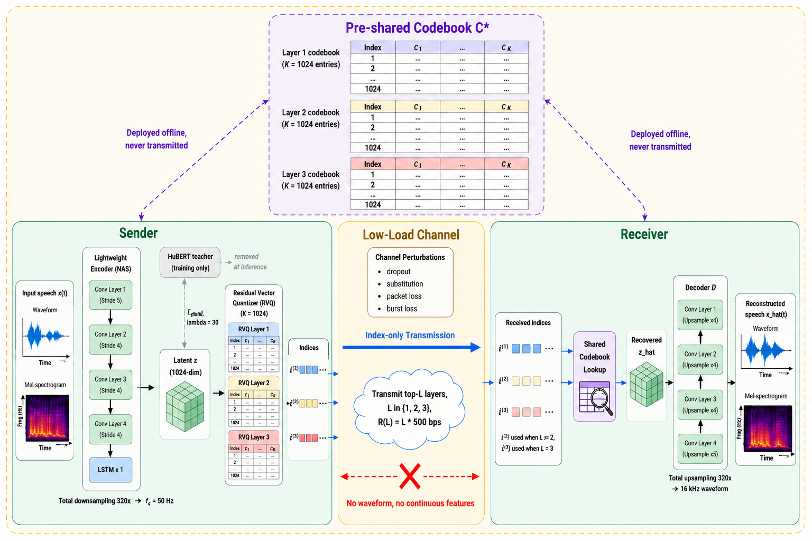
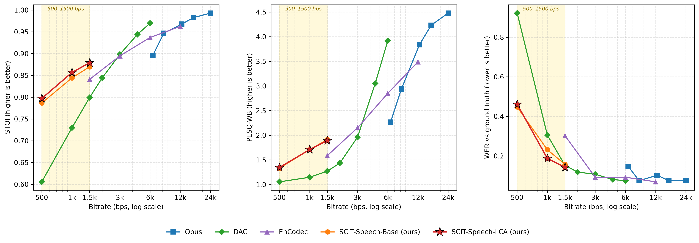
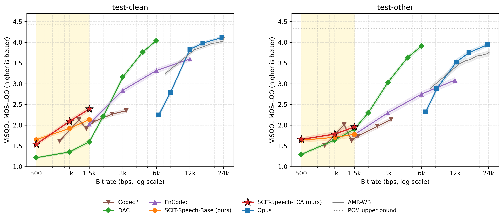
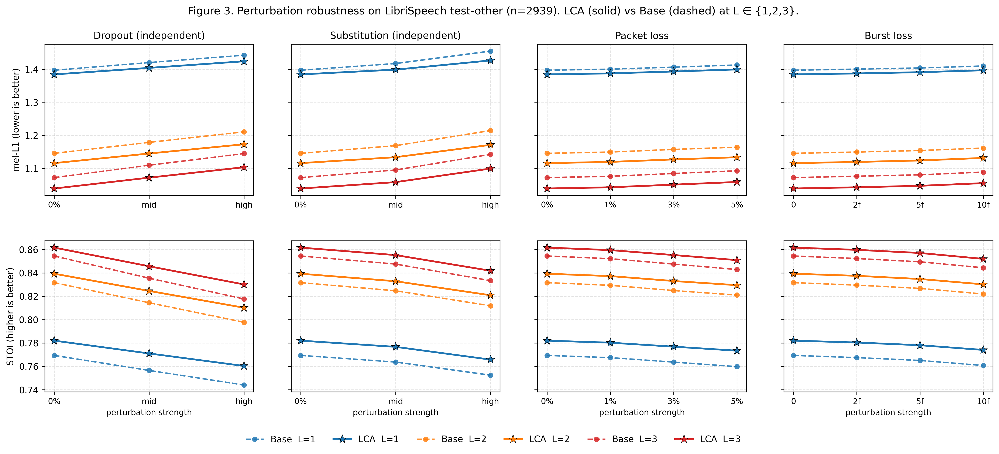
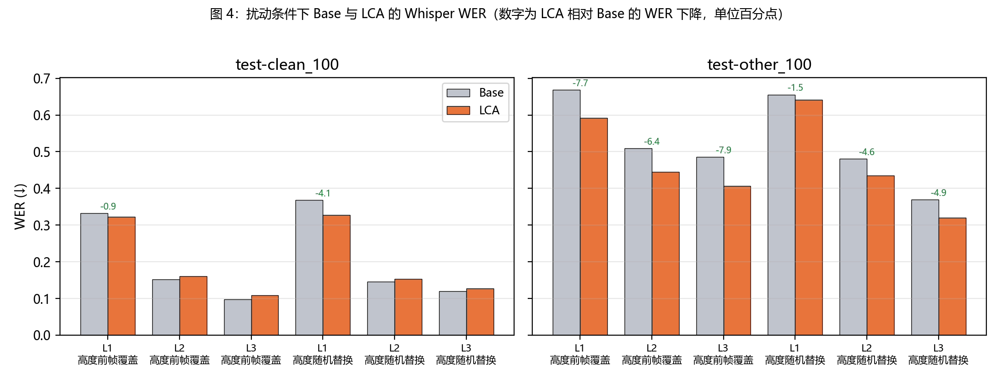
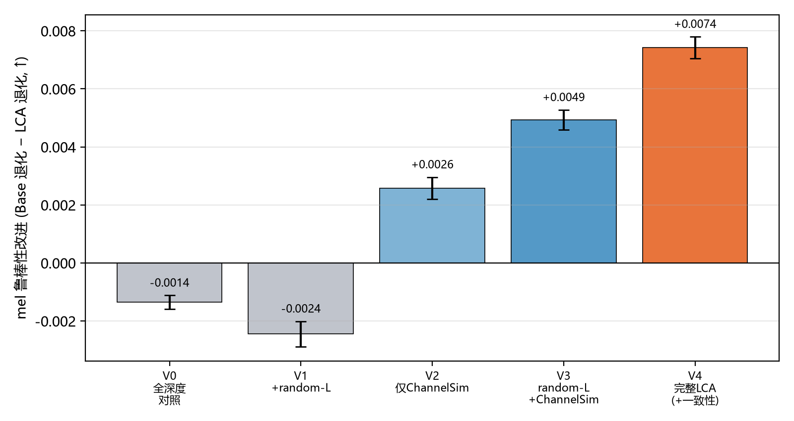

# SCIT-Speech：基于共享 RVQ 码本索引传输的极低码率语音通信

## 摘要

我们提出 SCIT-Speech，一个面向 500–1500 bps 极低码率语音通信的离散索引传输系统。SCIT-Speech 把分层残差向量量化（RVQ）码本与解码器作为发送端与接收端预共享的系统知识，运行时信道仅传输前 `L` 层 RVQ 索引；在每层码本含 1 024 个码字、潜在帧率 50 Hz、3 层 RVQ 的当前实例下，理想索引负载为每层 500 bps，对应 500/1000/1500 bps 三个工作点。

围绕该接口我们给出三项设计。其一，受约束的教师引导分阶段神经架构搜索（NAS，neural architecture search）协议，并由该协议得到一个相对手工 SEANet 编码器在参数量、乘累加运算量（MACs，multiply–accumulate operations）、实时率上分别下降 86.9%、89.5%、55.1% 的发送端编码器候选。其二，SCIT-Speech-Base 训练：采用波形重建、多尺度 mel 频谱、对抗、码本承诺与 HuBERT 语义蒸馏的联合目标，在 LibriSpeech train-clean-100 上得到稳定收敛的 Base 模型。其三，低负载信道感知适配（LCA）微调：由随机操作点采样、强信道扰动模拟（索引前帧覆盖 与随机替换）与 mel 域无扰动—扰动一致性损失三部分组成。

在 LibriSpeech `test-clean` (n=2620) 与 `test-other` (n=2939) 全量评估上，LCA 在全部 6 个无扰动单元上一致降低 mel-L1、提高 STOI；在全部 12 个索引前帧覆盖/替换单元与全部 12 个丢包/突发丢失单元上 mel-L1 与 STOI 全部改善，PESQ 在多数条件下改善。在 Whisper base.en ASR 上，`test-other(n=300)` 全部 L 层与 `test-other(n=100)` 全部扰动条件下 WER 一致下降；`test-clean(n=300)` 在 L=1/L=3 改善而 L=2 持平略升，`test-clean(n=100)` 在最低操作点 L=1 高度随机替换条件下 WER 大幅下降。消融显示，HuBERT 语义蒸馏在相同训练步数对照下显著改善验证集 mel 重建与各 L 层 ASR 可懂度；LCA 三组件的逐组件因子化消融（n=256 × 12 单元配对评估）显示信道扰动模拟、随机操作点采样、一致性损失三者均给出统计显著的边际贡献，详见 §6.1。

**关键词**：极低码率语音通信；共享码本；RVQ 索引传输；信道感知训练；NAS 语音编码器；语义蒸馏

## 1 引言

未来通信系统在卫星窄带回传、应急中继、嵌入式语音前端、多用户边缘网关等场景下，单路语音可分配的实际负载常远低于常规宽带 codec 的工作区间。在 500–1500 bps 这一极低码率区间，系统目标不再是逼近无损波形，而是在受控负载下保持可懂度、自然度与下游可用性。

近年来神经音频压缩与语音离散表征工作（SoundStream、EnCodec、DAC、SpeechTokenizer、WavTokenizer）[1-5] 已在低码率语音重建上取得显著进展，但这类方法的系统化评估通常集中在 6 kbps 及以上，且把码本与解码器视作可学习模型的一部分而非系统层接口。语音语义通信工作（DeepSC-S、DeepSC-ST 与近期结合大模型的语义通信工作）[11-15] 把联合信源—信道编码（JSCC）思想引入语音传输，但运行时实际占用信道的对象与码率核算仍存在不明确之处。

本文研究一个更窄的问题：**如果发送端与接收端预先共享 RVQ 码本与解码器，运行时信道仅传输前 `L` 层离散索引，能否在 500–1500 bps 区间得到可用的语音质量与扰动鲁棒性。** 我们把这一系统称为 SCIT-Speech（Shared-Codebook Index Transmission Speech）。在该接口下，码率核算可写成"层数 × 潜在帧率 × 每索引比特数"的封闭形式；`L` 成为单一通信旋钮；通信扰动可被建模为对离散索引序列的前帧覆盖、随机替换、丢包与突发丢失。

本文贡献：

1. 提出 SCIT-Speech 共享码本索引传输接口，把 RVQ 码本与解码器作为预共享系统知识、运行时信道仅传输离散索引；在每层 1 024 码字、潜在帧率 50 Hz、3 层 RVQ 实例下给出 500/1000/1500 bps 三个可控工作点；
2. 提出受约束的教师引导分阶段 NAS 搜索协议，并由该协议得到一个相对手工 SEANet 编码器在参数量、MACs、实时率上分别下降 86.9%、89.5%、55.1% 的发送端编码器候选；
3. 提出低负载信道感知适配（LCA）训练方案，由随机操作点采样、强信道扰动模拟与一致性损失三组件组成，并通过 V0–V4 因子化消融量化每一组件的边际贡献。

上述设计在 LibriSpeech `test-clean` (n=2620) 与 `test-other` (n=2939) 全量上接受无扰动重建、索引前帧覆盖与替换、丢包与突发丢失三类客观评估，并在 Whisper base.en 子集上接受无扰动与扰动条件下的 ASR/WER 评估（详见 §4–§5）。

我们不主张在所有码率与所有指标上击败既有 codec：在 6 kbps 以上 Opus、DAC 仍是更优选择；当前 500–1500 bps 区间的同码率对照在 `test-clean`/`test-other` 各 300 条样本上完成、给出 95% bootstrap CI 与配对显著性（详见 §5.1 与 §7 局限性）。本文的有效区间为 500–1500 bps。

## 2 相关工作

**神经音频 codec 与离散语音表征**。SoundStream [1]、EnCodec [2]、DAC [3] 用端到端编码器—解码器结合 RVQ 实现可变码率神经音频压缩；SpeechTokenizer [4]、WavTokenizer [5]、Mimi [6] 进一步探索语音离散表征在语言模型与流式低码率下的统一接口。RepCodec [7] 把 codec 重构对象从波形改为 HuBERT/data2vec 等自监督表示，强调离散表征的语义保真度。这些工作的主要操作带在 6 kbps 及以上（Mimi 在 1.1 kbps 流式工作，但解码端仍是大型生成模型），且把码本与解码器视作可学习模型的一部分而非系统层接口。我们沿用 RVQ 与多层结构，但把码本与解码器从"可学习模型"重新定位为"预共享系统知识"，并把评估操作带下移到 500–1500 bps。

**语义特征蒸馏与语义—声学分层**。HuBERT [8] 以及在其之上的语音离散单元被广泛用作 codec 的语义监督信号。SpeechTokenizer [4] 用 HuBERT 蒸馏把语义信息集中到第 1 层 RVQ；AudioLM [9] 把语义表征与声学表征显式分层并以语言模型串联两级；VALL-E [10] 则直接把 EnCodec [2] 的离散码作为语言模型建模目标。本文沿用"HuBERT 蒸馏 + 多层 RVQ"的语义—声学分层思想（§3.3 的 `λ_distill = 30`），但目的不是为下游语言模型提供输入符号，而是为低 `L` 工作点（`L = 1` 仅传 500 bps）保留可懂度——其对低码率可懂度的配方验证见 §6.4。

**语音语义通信与离散接口下的联合信源—信道编码**。DeepSC-S [11]、DeepSC-ST [13] 与 Qin 等综述 [12] 把语义通信思想引入语音传输，多采用高维**连续**联合信源—信道编码映射 [16] 把语音直接映到信道符号；近期 LargeSC [14] 引入大型语音基础模型作为收发端先验，Glaris [15] 把抗丢包恢复机制建在语义通信框架内。这一族工作以"连续语义向量进入信道"为接口，码率核算依赖具体调制与信道符号开销。本文采取互补但不同的路径：在共享 RVQ 码本下把信道传输对象明确化为**离散索引**，码率成为 `R(L) = L · f_q · ⌈log₂ K⌉` 的封闭形式（§3.1），通信扰动也相应被建模为索引层面的前帧覆盖、随机替换、丢包与突发丢失，无需依赖大模型解码端。

**丢包扰动下的神经语音重建**。神经丢包隐藏（PLC）在波形或频谱域估计丢失帧——Valin 等 [17] 用混合生成—预测模型实时填补丢失内容，tPLCnet [18] 用短上下文时域网络做实时丢包隐藏，BS-PLCNet 系列把全频带丢包隐藏任务拆分为多频段子任务。这类工作把"丢包"视为接收端波形缺失，在解码后做单独的修复模块。本文 §3.4 的 LCA 训练把索引层面的前帧覆盖、随机替换、丢包与突发丢失直接作用在传输的 RVQ 索引序列上，并通过 mel 域的无扰动—扰动一致性损失让同一解码器在扰动索引下产生与无扰动重建一致的输出。这与"额外丢包隐藏模块"的路线互补：扰动鲁棒性被内化到 codec 解码器，作用在离散索引层而非解码后波形层，运行时不引入第二个推理网络（量化证据见 §6.3）。

**语音 / 音频编码器 NAS**。NAS 经典方法 DARTS [19]、ProxylessNAS [20] 已把硬件感知的搜索范式带入工业级模型；LightSpeech [21] 是较早把 NAS 用于轻量化语音模型（FastSpeech 系 TTS）的工作。这些工作或针对图像分类与通用 CNN（[19, 20]），或针对 TTS 声学模型 [21]，搜索目标与"低码率语音通信发送端编码器"的接口契约不同。本文 §3.2 的搜索约束更窄：固定潜在维度 1024、总下采样 320、潜在帧率 50 Hz 的接口契约，固定 RVQ 配置（`K = 1024`、`n_q = 3`，码本不参与搜索），并用冻结的教师引导分阶段代理（架构剖面 → 短程蒸馏 → 精化代理 → Pareto 终选），把参数量、MACs、实时率三个发送端硬件指标显式纳入第 1 阶段的资源门控与第 4 阶段的多目标排序，得到一个相对手工 SEANet 编码器大幅压缩发送端开销的轻量编码器候选（具体压缩比见 §3.2、§6.3）。

## 3 方法



**图 1**：SCIT-Speech 系统总览。RVQ 码本 `C*` 与解码器 `D` 在发送端与接收端预先离线部署，运行时不进入信道；信道仅传输前 `L` 层离散索引，`L ∈ {1, 2, 3}` 对应 500/1000/1500 bps。图示为 `L = 3` 情况，`i^(2)` 与 `i^(3)` 在 `L = 1` 与 `L = 2` 操作点下不传输（用淡色表示）。信道扰动（索引前帧覆盖、随机替换、丢包、突发丢失）作用于离散索引序列。HuBERT 教师分支（灰色虚线）仅在训练阶段参与蒸馏（`λ_distill = 30`），推理时移除。

**符号约定**。本节及 §3.1–§3.2 沿用以下符号：`x` 输入波形；`x̂` 重建波形；`E_θ` 编码器（参数 θ）；`D` 解码器（在 SCIT-Speech 系统中为发送/接收端预共享）；`C*` 预共享 RVQ 码本族（`M` 层）；`Z` 编码器量化前连续输出；`q^{(1)}` 第 1 层 RVQ 量化后特征（语义蒸馏的对齐对象）；`I` 全 `M` 层索引张量；`I_{1:L}` 前 `L` 层截断索引；`Ĩ_{1:L}` 经信道扰动后的索引；`M = n_q` RVQ 总层数；`L ∈ {1, ..., M}` 运行时传输层数（操作点）；`K` 单层码本大小；`f_q` 潜在帧率（Hz）；`T_q` 潜在帧数；`R(L)` 索引负载（bps）；`φ_s` 第 s 个尺度的对数 mel 算子；`h^{HuBERT}` HuBERT 教师特征。

### 3.1 共享码本索引传输

设输入语音 `x(t)`，发送端编码器 `E_θ` 输出连续表示 `Z = E_θ(x) ∈ R^{T_q × d}`。`Z` 经分层 RVQ 量化为 `M = n_q` 层离散索引 `I = {i_{m,t}}`，发送端与接收端预共享码本 `C* = {C_1*, ..., C_M*}`、解码器 `D` 与系统配置；运行时信道只传输前 `L` 层索引 `I_L = I_{1:L,:}`，接收端经 `x̂ = D(C*(I_L))` 重建。

我们的当前系统实例取 `M = n_q = 3`、`K = 1024`、采样率 16 kHz、编码器总下采样率 320，因此潜在帧率 `f_q = 50` Hz（即每秒 50 个潜在帧）。每个索引需 `b = ⌈log₂ K⌉ = 10` 比特表示，仅算离散索引、不计分组化与协议栈开销时的紧凑封装上界为 `R(L) = L · f_q · ⌈log₂ K⌉ = 500 L` bps，`L ∈ {1, 2, 3}`，对应 500 / 1000 / 1500 bps 三个工作点。以 16 kHz、16 bit 线性 PCM（256 kbps，与 §5 无损参照一致）为原始语音基准，三个工作点分别对应约 512×（L=1）、256×（L=2）、171×（L=3）的压缩比。

`R(L) = 500 L` 是均匀编码（每索引固定 10 bit）下、仅计离散索引 payload 的码率上界。在 600 条样本（test-clean/other 各 300）上累积各层索引直方图后，按经验熵估计的无损编码理论下界更低：L=1 约 398–415 bps（低于 `500 L` 上界 17–20%）、L=2 约 838–882 bps、L=3 约 1 301–1 356 bps。其中第 1 层索引的经验熵仅约 8.0–8.3 bit（低于 10 bit 名义容量），与 §7 第 5 条所述"第 1 层码本结构性低利用率"互为印证——第 1 层承担帧级语义标签，实际所需信息量低于其名义容量。三个量的关系为：熵编码 payload 下界 ≤ `500 L`（本文统一报告口径）≤ 含分组化与协议栈的真实在线码率（见下段）；本文正文与对照实验统一以居中且保守的 `500 L` bps 报告码率。

真实在线码率还需叠加分组化与协议栈开销。基于实测 payload 与协议栈建模，相对 `500 L` 的 packet 开销随打包间隔与协议栈变化：在对实时语音友好的 RTP-only、100 ms 打包下开销最小（L=1 +204%、L=2 +100%、L=3 +65%）；常用 UDP+IPv4+RTP 栈下为 L=1 +652%、L=2 +334%、L=3 +215%；仅在 20 ms 打包 + UDP+IPv6 这一对极短帧、最重头部的极端配置下达到上界（L=1 +4860%、L=2 +2420%、L=3 +1607%）。`L` 越大，固定 header 被摊薄得越充分，相对开销越低。这部分工程开销随部署协议栈与打包间隔变化，故不计入 §5 的同码率对照（详见 §7 第 7 条）。

### 3.2 受约束 NAS 发送端编码器

发送端计算成本对低负载语音通信同样重要。我们用教师引导的分阶段 NAS 在固定接口契约下搜索编码器架构。

**搜索空间**。围绕 SEANet 编码器展开，各维度候选见表 1。

**表 1：NAS 编码器搜索空间**

| 维度 | 候选值 | 候选数 | 备注 |
|---|---|:---:|---|
| `encoder_strides` | `[8,5,4,2]` / `[5,4,4,4]` / `[10,4,4,2]` / `[4,5,4,4]` / `[4,4,5,4]` / `[4,4,4,5]` | 6 | 乘积固定为 320 |
| `n_filters` | 24 / 32 / 48 | 3 |  |
| `compress` | 2 / 4 | 2 | 残差块内瓶颈压缩比 |
| `lstm` | 1 / 2 | 2 | 瓶颈 LSTM 层数 |
| `activation` | ELU / Snake | 2 | |
| 每块算子（×4 块独立） | 标准卷积 k∈{3,5,7}；可分离卷积 k∈{3,5,7,9}；空洞卷积 k∈{3,5,9}；点卷积瓶颈 k=3；跳过连接 | 12 | 每编码器至多 1 块取跳过连接 |
| 每块 SE（×4 块独立） | 开 / 关 | 2 | 取跳过连接的块强制关闭 SE |

解码器策略沿用对编码器步长序列做反序，本身不参与搜索。

**NAS 训练协议**。

- **第 1 阶段（架构剖面与资源门控）**：对每个候选静态估计参数量、MACs 与实时率（RTF），用三者相对手工 SEANet 编码器的加权对数比打分，保留前若干进入第 2 阶段。
- **第 2 阶段（短程蒸馏代理与教师对齐）**：每个候选编码器与**冻结的预训练教师**配对做短程蒸馏，目标为潜在 SmoothL1 `L_sl1`、余弦距离 `L_cos` 与时序差分 `L_Δ` 三项加权和（定义见下文式 (NAS-1)–(NAS-4)），对齐到教师在量化前的潜在表示；以资源代理分数与质量边距联合打分（打分函数见下文式 (NAS-5)–(NAS-9)），保留前若干进入第 3 阶段。
- **第 3 阶段（精化代理）**：在第 2 阶段设置上延长短程蒸馏，并在更大子集上评估 RVQ 兼容性诊断量，保留前若干进入第 4 阶段。
- **第 4 阶段（终选与 Pareto 排序）**：进一步延长短程蒸馏，在更大子集上做多目标 Pareto 排序——目标侧包含教师对齐损失、量化兼容性与重建代理；资源侧包含编码器 MACs、参数量、实时率均值；从 Pareto 前沿中选出最终架构。

**短程蒸馏对齐损失定义**。设候选编码器在量化前输出潜在表示 `z^s ∈ R^{B × T × d}`、冻结教师对应输出 `z^t ∈ R^{B × T × d}`（`B` 批大小、`T` 潜在帧数、`d = 1024` 潜在维度）；两者先在时间维按较短长度对齐。三项对齐损失定义如下：

潜在 SmoothL1（Huber，逐元素后取均值）：

```
L_sl1 = (1 / (B·T·d)) · Σ_{b,t,j} h_β( z^s_{b,t,j} − z^t_{b,t,j} ),                          (NAS-1)

其中 h_β(e) = 0.5·e² / β,           |e| < β
              |e| − 0.5·β,          |e| ≥ β        （β = 1.0，PyTorch smooth_l1 默认）
```

余弦距离（沿特征维 `d` 计算余弦相似度，对 `(b,t)` 取均值后取 1 减之，并下截断到 0）：

```
L_cos = max( 0,  1 − (1/(B·T)) · Σ_{b,t}  ⟨z^s_{b,t,:}, z^t_{b,t,:}⟩ / (‖z^s_{b,t,:}‖₂ · ‖z^t_{b,t,:}‖₂) ).   (NAS-2)
```

时序差分（先对学生与教师各自取相邻帧一阶差分 `Δz_{b,t} = z_{b,t} − z_{b,t−1}`，再对两者的差分做 SmoothL1；`T = 1` 时该项置 0）：

```
Δz^s_{b,t} = z^s_{b,t} − z^s_{b,t−1},   Δz^t_{b,t} = z^t_{b,t} − z^t_{b,t−1},   t = 2, …, T

L_Δ = (1 / (B·(T−1)·d)) · Σ_{b,t≥2,j} h_β( Δz^s_{b,t,j} − Δz^t_{b,t,j} ).                       (NAS-3)
```

短程蒸馏总目标为三项加权和：

```
L_distill_proxy = w_sl1 · L_sl1 + w_cos · L_cos + w_Δ · L_Δ,    (w_sl1, w_cos, w_Δ) = (1.0, 1.0, 0.5).   (NAS-4)
```

三项各司其职：`L_sl1`（式 NAS-1）以 Huber 形式逐元素对齐潜在表示的**绝对数值**，对离群值比纯 L2 更鲁棒；`L_cos`（式 NAS-2）对齐潜在向量的**方向**，约束学生在语义子空间上的朝向与教师一致；`L_Δ`（式 NAS-3）对齐相邻帧之间的**时间变化率**，使学生复现教师潜在轨迹的动态结构，而非仅匹配静态帧。三者分别覆盖"幅度—方向—动态"三个互补维度。各阶段权重 `(1.0, 1.0, 0.5)` 与保留候选数、蒸馏步数、子集大小等具体取值见 §4.5。

**第 2 阶段联合打分函数**。第 2 阶段不直接用上述蒸馏损失绝对值排序，而是把每个候选的代理指标**相对手工 SEANet 教师**做对数比，并按"资源 + 质量"两类合成一个**惩罚分** `S`。记候选某指标为 `v`、教师同指标为 `v_ref`，定义两个基本算子：

```
对数比:        r(v, v_ref) = log( v / v_ref )                                        (NAS-5)
单边超额惩罚:  e(v, v_ref, m) = max( 0,  r(v, v_ref) − log(1 + m) )                  (NAS-6)
```

`r(·)` 度量候选相对教师的相对优劣（负值表示候选更省/更好）；`e(·)` 是带容差 `m`的**单边 hinge**——仅当候选比教师差、且差距超过 `log(1+m)` 时才计正惩罚，候选在容差内时惩罚为 0。资源指标用 `r(·)`，质量指标用 `e(·)`。

资源项与质量项分别为：

```
S_res = w_macs · r(MACs, MACs_ref) + w_params · r(params, params_ref) + w_rtf · r(RTF, RTF_ref)    (NAS-7)
S_qual = w_sem · e(sem, sem_ref, m_sem) + w_recon · e(recon, recon_ref, m_recon)
       + w_mel · e(mel, mel_ref, m_mel)                                    （重建代理三项）
       + w_sl1 · e(L_sl1, L_sl1^ref, m_lat) + w_Δ · e(L_Δ, L_Δ^ref, m_Δ)
       + w_cos · max(0, L_cos − L_cos^ref − m_cos)                          （教师对齐三项）   (NAS-8)
```

其中 `sem / recon / mel` 为语义、波形重建、mel 三项重建代理损失，`L_sl1 / L_cos / L_Δ` 为式 (NAS-1)–(NAS-3) 的教师对齐损失（余弦距离因取值已在 `[0, 2]` 量纲、不取对数比，改用线性单边 hinge）。第 2 阶段总打分为两类之和：

```
S_stage2 = S_qual + S_res,        候选按 S_stage2 升序保留前若干。                       (NAS-9)
```

直觉上，`S_res < 0` 的候选被奖励，`S_qual > 0` 惩罚那些质量退化超过容差的候选；二者相加使排序在"省资源"与"不过度损质"之间权衡。

**第 3 / 第 4 阶段在此基础上追加 RVQ 兼容性惩罚项并改用多目标 Pareto 前沿排序**，目标侧与资源侧的具体项见 §4.5.4。各项权重 `w_*` 与边距 `m_*` 的具体取值见 §4.5.4。

整个 NAS 代理阶段使用冻结教师路径评估，代理的所有重建与 mel 数值仅作为相对排序依据，不直接构成 SCIT-Speech 的最终质量指标；最终质量需在 §3.3 的 SCIT-Speech-Base 完整训练后衡量。各阶段保留候选数、短程蒸馏步数、子集大小、加权权重等具体取值见 §4.5；选出的最终架构的具体配置与相对手工 SEANet 编码器的参数量、MACs、实时率对比见 §6.4。

进入 §3.3 的 SCIT-Speech-Base 完整训练时，候选编码器的解码器步长改回对编码器步长的反序，与 §3.3 的完整目标 `L_full`（含对抗、蒸馏、承诺）一起从头训练得到 SCIT-Speech-Base。


### 3.3 SCIT-Speech-Base 训练

SCIT-Speech-Base 沿用 RVQ 加生成对抗网络（GAN，generative adversarial network）的神经 codec 训练范式（SoundStream / EnCodec [1, 2] 的残差量化自编码器、HiFi-GAN 风格多判别器、SpeechTokenizer [4] 的语义蒸馏分层），把编码器 `E_θ`、RVQ 量化器与解码器 `D` 整体作为生成器 `G` 端到端联合训练，并与判别器集合 `D̂` 做对抗交替优化：每个训练步先以真实波形与重建波形更新判别器、再回头更新生成器。

训练思路上有两个关键设计支撑后续的低 `L` 工作点。其一，**语义—声学分层**：HuBERT 语义蒸馏不作用在编码器整体输出上，而是专门对齐到**第 1 层 RVQ 量化后的特征** `q^{(1)}`（即 SpeechTokenizer [4] 的核心做法），逼第 1 层承载帧级语义、其余层以残差形式补充声学细节；这是 `L = 1` 仅传 500 bps 仍保留可懂度的机制根基。其二，**各损失项分工互补**：波形 L1 与多尺度 mel 提供重建保真度（mel 项为主），对抗与特征匹配损失补回 L1/mel 难以刻画的高频细节与自然度，码本承诺损失稳定 RVQ 训练，语义蒸馏正则化第 1 层的语义子空间。

形式化地，设输入波形 `x`、模型重建 `x̂ = D(C*(I))`。Base 训练在 LibriSpeech train-clean-100 上以如下联合目标优化生成器 `G` 与判别器集合 `D̂`：

```
L_full = L_mel(x, x̂) + λ_recon · L_recon(x, x̂)
       + L_adv(D̂, x̂) + L_feat(D̂, x, x̂)
       + λ_q · L_commit + λ_distill · L_distill(q^{(1)}, h^{HuBERT}(x))
```

各分量定义如下：

- `L_recon = ‖x − x̂‖_1`（波形 L1）。
- `L_mel = Σ_s w_s · ‖φ_s(x) − φ_s(x̂)‖_1`，其中 `φ_s` 是多尺度对数 mel 频谱算子，含 4 个短时傅里叶变换（STFT，short-time Fourier transform）尺度，所有尺度共享同一组 mel 滤波器配置（80 个 mel 通道、Slaney 归一化、HTK mel 刻度）；mel 幅度先按一个小正数下界截断再取自然对数。最大 STFT 尺度对应的项相对其它尺度赋予较高权重；具体 STFT 窗长、跳长与权重设置见 §4.5 实现细节。
- `L_adv` 与 `L_feat` 为 HiFi-GAN 风格的最小二乘 GAN 对抗损失与判别器中间特征匹配损失。判别器 `D̂` 由三组组成：多周期判别器、多尺度时域判别器（最高时域尺度上启用谱归一化）、多尺度 STFT 判别器；三组共用一个判别器优化器。
- `L_commit` 为 RVQ 码本承诺损失（commitment loss）。
- `L_distill = − E_{b,t}[ log σ(cos(q^{(1)}_{b,t}, h^{HuBERT}_{b,t})) ]`：将**第 1 层 RVQ 量化后特征** `q^{(1)}`（而非编码器整体输出）与 HuBERT 教师特征 `h^{HuBERT}(x)`（教师仅训练时参与，推理时移除）沿特征维计算余弦相似度并对齐时间维取较短长度，再取二值逻辑斯蒂形式的负对数概率聚合。把蒸馏专门施加在第 1 层即实现语义—声学分层（见本节开头）；蒸馏权重控制该语义子空间正则化的强度，是本文研究的主要训练超参之一（见 §4.5 与 §6.1）。

波形重建、码本承诺与语义蒸馏等分量的具体权重、训练数据、优化器、批大小、波形片段长度、学习率、训练步数与最优验证集 mel 重建误差等实现细节统一在 §4.5 列出。该 Base 模型权重作为后续 LCA 微调的底模。

### 3.4 SCIT-Speech-LCA：低负载信道感知适配

在 SCIT-Speech-Base 之上做端到端微调，把训练目标拆成两个分支：**全深度分支**沿用 §3.3 的 `L_full`（在 `L = M` 与无信道扰动条件下计算），**通信分支**显式建模信道。每训练步的总损失

```
L_LCA = λ_full · L_full + λ_comm · L_comm
```

其中 `L_comm` 由三部分组合，对应三项设计：

**(1) 随机操作点采样（random-L）**。每训练步在 `L ∈ {1, 2, 3}` 中按均匀分布独立采样一个操作点，避免模型只在全深度下最优。我们采用步级采样（同一批内所有样本共用同一 L），目的是让同一前向中的判别器输入序列长度、对抗损失与特征匹配损失的张量布局都对应单一 L，避免不同 L 在同一步内交叉污染梯度尺度。采用均匀分布而非偏向某个 L 的非均匀分布，部署侧（卫星窄带回传、应急中继、多用户边缘网关）对工作点的偏好取决于即时信道预算，训练阶段无先验信息；均匀采样使三个操作点得到等量的训练步，对应"对所有 L 等同优化"的最弱假设。设当前步采样到 `L`，发送端对一批样本编码得到全 3 层索引，截断到前 `L` 层得到 `I_{1:L}`。

**(2) 信道扰动模拟（ChannelSim）**。在五种信道条件 {无扰动、中度前帧覆盖、高度前帧覆盖、中度随机替换、高度随机替换} 中按均匀分布采样一组扰动参数。**前帧覆盖**以独立伯努利概率在每个  位置抹除该位索引，并用同一批同一层的**原始** `t−1` 帧索引 `I_{ℓ, b, t−1}` 覆盖被命中位置（即一次性切片得到的前一帧张量，不做迭代向前回填；连续多帧被命中时第 k 帧得到的仍是原始 `t−1` 处的索引；`t = 0` 不命中；`T = 1` 时跳过此操作）；**随机替换**则以独立伯努利概率把命中位置的索引在 `{0, ..., K−1}` 内均匀替换。**前帧覆盖与随机替换在条件级别互斥**——五种条件中至多一类的概率非零，因此每步要么仅经历前帧覆盖、要么仅经历随机替换、要么完全无扰动，并非每步把两类扰动叠加施加；最终得到扰动后的索引张量 `Ĩ_{1:L}`。

五种条件对应的扰动概率取值如下：

| 条件 | `p_drop` | `p_sub` |
|---|---:|---:|
| 无扰动（clean） | 0 | 0 |
| 中度前帧覆盖 | 0.05 | 0 |
| 高度前帧覆盖 | 0.10 | 0 |
| 中度随机替换 | 0 | 0.01 |
| 高度随机替换 | 0 | 0.03 |

信道扰动模拟仅模拟单帧级独立扰动；多帧成段扰动（packet 丢失、burst 丢失）不在训练阶段施加，仅由 §4.3 在评估端定义，用于检验训练分布外的泛化。

设 `D` 为共享解码器，`C*` 为共享码本：

```
x̂_clean = D(C*(I_{1:L})),     x̂_pert = D(C*(Ĩ_{1:L}))
```

由此得到通信分支的重建项：

```
L_comm_recon = L_mel(x, x̂_pert) + λ_recon · L_recon(x, x̂_pert)
```

`L_mel`、`L_recon`、`λ_recon` 与 §3.3 完全一致。

**(3) Mel 域无扰动—扰动一致性损失**。当且仅当 `λ_consistency > 0` 且当前步采样到的信道条件有扰动时，额外加入

```
L_consistency = Σ_s w_s · ‖φ_s(x̂_clean) − φ_s(x̂_pert)‖_1
```

——对**同一组截断索引** `I_{1:L}`、**同一个解码器 `D`**、在**同一采样 L** 下的无扰动解码与扰动解码输出，以与 `L_mel` 完全相同的多尺度对数 mel 算子族（`φ_s, w_s`）施加 mel 域 L1 一致性约束。本文取 `λ_consistency = 0.5`。

`L_consistency` 的设计需配合 `L_comm_recon` 才能避免"扰动下复制偏差"的退化解：单独 `L_consistency` 只约束 `x̂_pert ≈ x̂_clean`，若 `x̂_clean` 偏离真值 `x`，模型可在扰动下保留同样偏差而不被惩罚；但 `L_comm_recon` 同时把 `x̂_pert` 拉向真值 `x`，两者并存时 `x̂_clean` 也被间接约束（经由解码器共享参数），形成"先逼近真值、再求扰动不变"的两级目标。`λ_consistency` 取 0.5（小于 `L_comm_recon` 的有效权重，且小于 `λ_full = 1.0`），保证扰动不变性是次级正则化而非主目标，避免压过全深度分支的真值监督。

从机制上看，随机替换是"错误内容"型扰动，一致性损失恰好将扰动解码拉回无扰动路径；前帧覆盖（用前一帧索引顶替）本就接近无扰动解码，可压缩的 gap 天然较小。这一差异化模式在 §6.3 的消融中得到定量佐证。

**梯度回传路径**。通信分支对编码调用包裹在停止梯度（stop-gradient）作用域内，截断索引 `I_{1:L}` 与扰动后的 `Ĩ_{1:L}` 不携带梯度；因此 `L_comm_recon` 与 `L_consistency` 的梯度仅沿解码器 `D` 反传，编码器与量化器的全部梯度来自全深度分支 `L_full`。这一设计的含义是：随机操作点采样与信道扰动模拟**不直接训练编码器与量化器抵抗扰动**，仅训练解码器在低 `L` 与扰动索引下产生干净重建；下文 §6.1 V0–V4 因子化中"random-L 单独无收益、ChannelSim 主导、一致性损失给出最后一跃"的现象与该梯度结构是自洽的。

最终

```
L_comm = L_comm_recon + λ_consistency · 1[cond ≠ clean] · L_consistency
```

我们以 `λ_full = 1.0`、`λ_comm = 1.5`、`λ_consistency = 0.5` 与上文表中给出的五条件扰动概率（最高 `p_drop = 0.10`、`p_sub = 0.03`）一起作为 LCA 正式方法（v2）；与之对照的弱扰动、无一致性损失早期版本（v1）作为消融对照保留，与正式配方的逐项差异、整体鲁棒性差距见 §6.2。LCA 模型权重选择协议见 §4.5。

## 4 实验设置

### 4.1 数据集与评估范围

模型训练数据是 LibriSpeech train-clean-100。主要评估在 LibriSpeech `test-clean` (n=2620) 与 `test-other` (n=2939) 上进行。§5.1 的同码率 codec 对比在 `test-clean` 与 `test-other` 各前 300 条样本上完成，给出 95% bootstrap CI 与配对显著性；§5.7 的跨语料 zero-shot 评估在 VCTK与 AISHELL-1各跨说话人均匀采样 300 条上完成。各评估子集均不参与 SCIT-Speech 模型选择。该样本量与领域偏差 caveat 见 §7。

ASR 子集 `test-clean_300` 与 `test-other_300` 各取自对应全量样本列表的前 300 条；扰动 ASR 子集 `test-clean_100` 与 `test-other_100` 进一步取自 300 子集的前 100 条。接口约定（采样率 16 kHz、总下采样 320、`f_q = 50` Hz、`n_q = 3`、`K = 1024`、`L = 1/2/3`）与 §3.1 一致。

### 4.2 模型与基线

**SCIT-Speech 模型族：**

- **SCIT-Speech-Base**：按 §3.3 训练 60 轮，作为 LCA 微调底模与无信道感知对照。
- **SCIT-Speech-LCA v2**：在 Base 之上按 §3.4 强档 ChannelSim + 一致性损失微调 10 轮。
- **SCIT-Speech-LCA v1**：弱档 ChannelSim、无一致性损失的早期版本，仅作 §6.2 消融对照。

**对照 codec（§5.1 同码率对比）：**

- **PCM**：16 bit @ 16 kHz，无损上界。
- **Opus**（libopus，ffmpeg 6.1.2）：6 / 8 / 12 / 16 / 24 kbps。
- **EnCodec** 24 kHz（ffmpeg 6.1.2）：`bw ∈ {1.5, 3.0, 6.0, 12.0}` kbps。
- **DAC** 16 kHz（ffmpeg 6.1.2）：`n_q ∈ {1, 2, 3, 4, 6, 9, 12}`。
- **AMR-WB**（libvo_amrwbenc，ffmpeg 8.1.1）：9 档 6.6–23.85 kbps。
- **Codec2**（libcodec2，ffmpeg 8.1.1）：6 档 {700C, 1200, 1300, 1600, 2400, 3200} bps。

AMR-WB / Codec2 因 ffmpeg 6.1.2 构建不含其编码器，单独使用 ffmpeg 8.1.1 完整构建，不影响其余基线。所有对照 codec 使用公开权重，未做微调。

### 4.3 扰动设置

评估端的扰动分两类，分别对应 LCA 训练分布内与分布外两种情形：

**索引级扰动**：直接复用 §3.4 (2) ChannelSim 的 5 条件参数表；评估时同一样本在所有 5 条件下分别解码一遍。

**通信化扰动**：训练时 ChannelSim 只覆盖单帧级独立扰动（前帧覆盖、随机替换），而评估时会新增下面的多帧成段扰动；它们只在评估端定义，用于检验 LCA 对训练分布外扰动模式的泛化：

- **丢包**：把索引序列按 5 个潜在帧（即 100 ms @ `f_q = 50` Hz，对应 RTP 实时语音常见 packet 时长）切分为定长 packet，对每个 packet 独立按 1% / 3% / 5% 概率整段丢失；丢失 packet 内前 `L` 层索引同时丢失，接收端用 packet 边界前最后一帧索引拼接（与 §3.4 (2) 前帧覆盖语义一致，但作用单位是 packet 而非单帧）。
- **突发**：在序列中随机选起点，连续丢失 2 / 5 / 10 帧（同样前 `L` 层一起丢，接收端同上拼接）。

与索引级扰动的关键区别在于作用单位：索引级扰动逐帧独立命中，通信化扰动按整段（packet / burst）成片丢失——后者对低 `L` 工作点更不利，因为一个 packet 同时带走该时段所有层的全部信息。


### 4.4 评价指标

**客观指标**：
- mel-L1：与 §3.3 的 `L_mel` 同算子
- 短时客观可懂度（STOI，short-time objective intelligibility，pystoi）
- 宽带感知语音质量评估（PESQ-WB，wideband perceptual evaluation of speech quality，pesq 宽带模式）
- 尺度不变信噪比（SI-SNR，scale-invariant signal-to-noise ratio）
- ViSQOL（Virtual Speech Quality Objective Listener，v3，语音模式 16 kHz，full-reference，google/visqol conformance v333）：输出类 MOS 的 MOS-LQO（约 1–5，越高越好）；对神经/生成式 codec 比 PESQ-WB 更鲁棒，故作为 §5.1 同码率对照的补充感知度量。
- 波形 L1：`‖x − x̂‖_1`；相关系数：以上两项仅用于 §6.2 消融诊断，不列主结果表。

**任务层指标**：用 Whisper base.en 对重建语音做 ASR，以确定性贪心解码得到转写结果，经标准文本规范化后与参考文本对比计算；工具版本与解码配置见附录 A。
- 词错误率（WER，word error rate）
- 字错误率（CER，character error rate）

**WER 测量地板（PCM 下界）**：把无损 PCM passthrough 直接送入 Whisper，得到的 WER / CER 即测量地板：
- `test-clean_300`：corpus WER 0.0359、宏平均 WER 0.0486；corpus CER 0.0129
- `test-other_300`：corpus WER 0.1552、宏平均 WER 0.1915；corpus CER 0.0709


### 4.5 实现细节

#### 4.5.1 训练通用配置

训练数据 LibriSpeech train-clean-100，波形片段长度 1 秒（16 000 样点 @ 16 kHz）；批大小 8、梯度累积 4、有效批大小 32；Adam 优化器（β₁ = 0.9，β₂ = 0.99，权重衰减 = 0）；余弦退火；bf16 混合精度；随机数种子 = 42。

损失权重：`λ_recon = 500`、`λ_q = 10`、`λ_distill = 30`（与 §3.3 公式对应）。多尺度对数 mel 损失采用 4 个 STFT 尺度，参数 `(n_fft, hop, win) ∈ {(1024,240,1024), (512,120,512), (256,60,256), (128,30,128)}`，权重 `w_s = [45, 1, 1, 1]`。判别器：多周期判别器周期 `{2, 3, 5, 7, 11}`；多尺度时域判别器 3 个尺度，最高尺度启用谱归一化；多尺度 STFT 判别器使用多种 STFT 配置、滤波器通道 32；三组共享一个判别器优化器。LCA 阶段沿用 Base 的判别器结构与上述权重，新增 `λ_full = 1.0`、`λ_comm = 1.5`、`λ_consistency = 0.5`（详见 §3.4 与表）。

#### 4.5.3 模型训练

**SCIT-Speech-Base**：在 §3.3 的损失配方下端到端训练 60 轮，初始学习率 1 × 10⁻⁴，取 验证集 mel-L1 最低值的模型权重。

**SCIT-Speech-LCA（v2）**：在 SCIT-Speech-Base 之上加载生成器权重；判别器、优化器、学习率调度器**从零重启**。微调 10 轮，初始学习率 1 × 10⁻⁵。每 2 500 步在验证集上跑 3 个 `L` × 5 个信道条件共 15 个验证单元的通信分支 mel 重建误差矩阵（下文简记 dev comm-mel），取第 30 000 步处 (高度随机替换 × `L=1/2/3`) 三个单元同时全局最优的模型权重作为正式 LCA 模型。

**评估配对协议**：所有评估按 (样本, 操作点 L, 信道条件) 三元组生成可配对数据点。Base / LCA / 各 NAS 变体在同一三元组下使用由样本编号、操作点 L 与条件名联合派生的**相同的 ChannelSim 随机种子**，保证同一样本在不同模型间的扰动模式完全一致；这使得 §6.2 / §6.3 的"按样本配对"分析具备统计严谨性。

#### 4.5.4 NAS 搜索与效率测量

§3.2 四阶段筛选的具体取值：
- **第 1 阶段**：随机生成 8 192 个候选；打分函数 `0.45 · log(MACs 比) + 0.45 · log(参数量比) + 0.10 · log(RTF 比)`，比值定义为候选相对手工 SEANet 编码器的比例；保留前 512 个。
- **第 2 阶段**：每个候选做 100 步短程蒸馏；蒸馏目标加权 `1.0 · SmoothL1 + 1.0 · 余弦距离 + 0.5 · 时序差分`（即式 NAS-4）；联合打分（式 NAS-5–NAS-9）中资源代理权重 `w_params / w_macs / w_rtf = 0.12 / 0.12 / 0.03`，质量边距阈值 `m = 0.1`（语义 / 波形重建 / mel 三项相对教师的退化均不超过该阈值）；保留前 64 个。
- **第 3 阶段**：短程蒸馏延长到 500 步，在 16 样本子集上评估 RVQ 兼容性诊断量；保留前 8 个。
- **第 4 阶段**：短程蒸馏延长到 1500 步，在 32 样本子集上做多目标 Pareto 排序——目标侧 7 项，分别为教师潜在 SmoothL1 、 教师潜在余弦距离 、教师时序差分损失 、量化后特征 L1 误差 、 语义代理损失 、波形重建代理损失 、mel 代理损失；另外还有 资源侧 3 项，分别为编码器 MACs 、参数量 、实时率均值，从前沿中选出最终架构。

## 5 结果

本节的主要结论有二。其一，在 500–1500 bps 的目标工作区间内，SCIT-Speech 于同码率下在 mel-L1、STOI、PESQ-WB 上一致优于 DAC 与 EnCodec。其二，信道感知适配（LCA）的增益在任务层最为显著：在困难语音叠加最强索引扰动的设置下，LCA 将 Whisper WER 最高降低 7.9 个百分点；在全量客观指标上则表现为频谱与可懂度相关指标的一致改善，而波形级指标改善有限（§5.4–§5.5）。下文按同码率对比、无扰动泛化、索引扰动、丢包/突发、ASR、跨语料 zero-shot 六个层级依次展开。

### 5.1 同码率对比



**图 2**：在 `test-clean_300` 与 `test-other_300`（各 n=300）上的码率—质量权衡曲线。三联子图分别展示 mel-L1、STOI、PESQ-WB；横轴为打包后的实际码率（对数刻度）。SCIT-Speech-LCA（红星，本文方法）与 SCIT-Speech-Base（橙圆）在 `L ∈ {1, 2, 3}` 对应 500/1000/1500 bps；对照 Opus（蓝方）、DAC（绿菱）、EnCodec（紫三角）覆盖各自支持的全部档位，PCM 给出无损上界。黄色阴影标识 SCIT-Speech 的工作区间。曲线点标注 95% bootstrap CI，配对 Wilcoxon 显著性见正文。

同码率对照在 LibriSpeech `test-clean` 与 `test-other` 各300 条样本上完成，所有数值给出 95% bootstrap CI（B=10 000，seed=42），同码率配对采用配对 Wilcoxon 符号秩检验，配对单位为同一样本。表 2a/2b 列出两个数据集的关键工作点；DAC、EnCodec、Opus 各自的完整档位见附录。

**表 2a：`test-clean_300` 同码率对比**

| 操作点 | 方法 | mel-L1 ↓ | STOI ↑ | PESQ-WB ↑ | ViSQOL ↑ |
|---|---|---|---|---|---|
| 500 bps | SCIT-Base L=1 | 1.146 [1.134, 1.157] | 0.809 [0.806, 0.812] | 1.343 [1.334, 1.351] | 1.647 [1.611, 1.685] |
| 500 bps | **SCIT-LCA L=1** | **1.122 [1.108, 1.137]** | **0.822 [0.819, 0.826]** | **1.390 [1.379, 1.402]** | 1.540 [1.502, 1.579] |
| 500 bps | DAC n_q=1 | 2.049 [2.027, 2.071] | 0.623 [0.618, 0.628] | 1.064 [1.060, 1.069] | 1.214 [1.196, 1.231] |
| 500 bps | Codec2 700C（实际 ~815 bps） | 3.730 [3.683, 3.781] | 0.532 [0.526, 0.538] | 1.408 [1.388, 1.430] | 1.613 [1.577, 1.651] |
| 1000 bps | SCIT-Base L=2 | 0.921 [0.911, 0.930] | 0.872 [0.869, 0.875] | 1.824 [1.801, 1.847] | 1.923 [1.875, 1.972] |
| 1000 bps | **SCIT-LCA L=2** | **0.898 [0.887, 0.911]** | **0.879 [0.876, 0.882]** | **1.823 [1.800, 1.847]** | 2.094 [2.042, 2.146] |
| 1000 bps | DAC n_q=2 | 1.453 [1.440, 1.465] | 0.740 [0.736, 0.744] | 1.150 [1.141, 1.159] | 1.354 [1.328, 1.381] |
| 1000 bps | Codec2 1200（实际 ~1.2k bps） | 3.245 [3.214, 3.276] | 0.667 [0.662, 0.671] | 1.621 [1.589, 1.654] | 2.128 [2.083, 2.173] |
| 1500 bps | SCIT-Base L=3 | 0.864 [0.855, 0.874] | 0.892 [0.889, 0.895] | 2.098 [2.067, 2.128] | 2.135 [2.084, 2.187] |
| 1500 bps | **SCIT-LCA L=3** | **0.838 [0.825, 0.851]** | **0.900 [0.897, 0.903]** | **2.097 [2.066, 2.128]** | 2.393 [2.340, 2.445] |
| 1500 bps | DAC n_q=3 | 1.232 [1.219, 1.245] | 0.799 [0.796, 0.803] | 1.284 [1.266, 1.303] | 1.600 [1.559, 1.641] |
| 1500 bps | EnCodec 1.5 kbps | 1.282 [1.266, 1.297] | 0.848 [0.845, 0.851] | 1.612 [1.585, 1.638] | 2.028 [1.978, 2.079] |
| 1500 bps | Codec2 1300（实际 ~1.4k bps） | 3.644 [3.609, 3.680] | 0.661 [0.656, 0.665] | 1.428 [1.402, 1.456] | 1.917 [1.878, 1.956] |
| 6 kbps（区间外） | Opus 6 kbps | 2.302 [2.275, 2.330] | 0.906 [0.903, 0.908] | 2.237 [2.187, 2.287] | 2.246 [2.194, 2.297] |
| 6 kbps（区间外） | EnCodec 6 kbps | 0.972 [0.955, 0.990] | 0.937 [0.935, 0.939] | 2.888 [2.843, 2.931] | 3.319 [3.263, 3.373] |
| 6.6 kbps（区间外） | AMR-WB 6.6 kbps（实际 ~7.2k） | 1.308 [1.281, 1.337] | 0.867 [0.864, 0.870] | 2.779 [2.738, 2.820] | 3.243 [3.200, 3.286] |
| lossless | PCM | 0.000 | 1.000 | 4.644 | 4.443 |

**表 2b：`test-other_300` 同码率对比**

| 操作点 | 方法 | mel-L1 ↓ | STOI ↑ | PESQ-WB ↑ | ViSQOL ↑ |
|---|---|---|---|---|---|
| 500 bps | SCIT-Base L=1 | 1.504 [1.457, 1.554] | 0.776 [0.771, 0.780] | 1.282 [1.267, 1.298] | 1.637 [1.589, 1.686] |
| 500 bps | **SCIT-LCA L=1** | 1.543 [1.502, 1.586] | **0.793 [0.788, 0.797]** | **1.312 [1.296, 1.329]** | 1.656 [1.609, 1.703] |
| 500 bps | DAC n_q=1 | 2.326 [2.292, 2.360] | 0.603 [0.598, 0.608] | 1.045 [1.042, 1.047] | 1.294 [1.269, 1.320] |
| 500 bps | Codec2 700C（实际 ~815 bps） | 4.075 [4.023, 4.127] | 0.489 [0.483, 0.494] | 1.279 [1.262, 1.297] | 1.508 [1.470, 1.546] |
| 1000 bps | SCIT-Base L=2 | 1.272 [1.222, 1.324] | 0.825 [0.820, 0.830] | 1.576 [1.542, 1.609] | 1.706 [1.645, 1.768] |
| 1000 bps | **SCIT-LCA L=2** | **1.269 [1.219, 1.322]** | **0.838 [0.834, 0.843]** | **1.588 [1.555, 1.622]** | 1.785 [1.723, 1.846] |
| 1000 bps | DAC n_q=2 | 1.696 [1.666, 1.726] | 0.726 [0.722, 0.729] | 1.102 [1.093, 1.111] | 1.641 [1.604, 1.678] |
| 1000 bps | Codec2 1200（实际 ~1.2k bps） | 3.445 [3.417, 3.472] | 0.647 [0.642, 0.651] | 1.370 [1.347, 1.394] | 2.013 [1.956, 2.070] |
| 1500 bps | SCIT-Base L=3 | 1.199 [1.150, 1.251] | 0.845 [0.840, 0.850] | 1.757 [1.715, 1.798] | 1.779 [1.714, 1.844] |
| 1500 bps | **SCIT-LCA L=3** | **1.190 [1.139, 1.244]** | **0.857 [0.853, 0.862]** | **1.756 [1.715, 1.797]** | 1.956 [1.885, 2.027] |
| 1500 bps | DAC n_q=3 | 1.429 [1.401, 1.458] | 0.784 [0.782, 0.787] | 1.166 [1.152, 1.181] | 1.905 [1.858, 1.951] |
| 1500 bps | EnCodec 1.5 kbps | 1.666 [1.624, 1.708] | 0.826 [0.822, 0.829] | 1.521 [1.498, 1.544] | 1.772 [1.719, 1.825] |
| 1500 bps | Codec2 1300（实际 ~1.4k bps） | 3.634 [3.602, 3.666] | 0.652 [0.647, 0.656] | 1.310 [1.289, 1.330] | 1.633 [1.592, 1.672] |
| 6 kbps（区间外） | Opus 6 kbps | 2.350 [2.313, 2.388] | 0.887 [0.883, 0.890] | 1.948 [1.908, 1.987] | 2.318 [2.262, 2.375] |
| 6 kbps（区间外） | EnCodec 6 kbps | 1.347 [1.306, 1.389] | 0.914 [0.911, 0.918] | 2.454 [2.407, 2.501] | 2.750 [2.685, 2.814] |
| 6.6 kbps（区间外） | AMR-WB 6.6 kbps（实际 ~7.2k） | 1.439 [1.404, 1.476] | 0.847 [0.843, 0.851] | 2.387 [2.333, 2.439] | 2.890 [2.830, 2.949] |
| lossless | PCM | 0.000 | 1.000 | 4.644 | 4.342 |

在 500/1000/1500 bps 三个工作点上，SCIT-LCA 在 mel-L1、STOI、PESQ-WB 上一致优于同码率的 DAC 与 EnCodec：与 DAC相比，test-clean 上 Δmel-L1 = -0.93/-0.55/-0.39、ΔSTOI = +0.20/+0.14/+0.10、ΔPESQ-WB = +0.33/+0.67/+0.81（L=1/2/3）；与 EnCodec 1.5 kbps相比，Δmel-L1 = -0.44、ΔSTOI = +0.05、ΔPESQ-WB = +0.49。所有差值 95% CI 不含 0、配对 Wilcoxon p < 0.001；test-other 上方向一致、幅度略小，详见附录配对表。唯一例外是 test-other L=1：LCA 的 mel-L1 略高于 Base（1.543 vs 1.504），但 STOI/PESQ-WB 仍优于 Base，且对 DAC 仍全面占优。

跨码率参照 Opus 6 kbps：mel-L1 维度 LCA L=3 大幅占优（test-clean -1.46、test-other -1.16，p<0.001），但 STOI/PESQ-WB 维度 Opus 6 kbps 略优于 LCA L=3（test-clean ΔSTOI -0.006、ΔPESQ -0.14；test-other ΔSTOI -0.029、ΔPESQ -0.19）。这是 libopus 在 ≤8 kbps 进入 SILK 窄带模式、内部采样率降到 8 kHz、>4 kHz 高频被整体截断带来的指标系统性偏差。

**区间内传统 codec 对照**。Opus 与 EnCodec 都无法工作在 500–1500 bps，区间内唯一可对照的传统 codec 是 Codec2。我们评测了 Codec2 700C/1200/1300/1600/2400/3200 六档。在与 SCIT-LCA 按样本配对的检验下，Codec2 在区间内全面落后。

test-clean 上 SCIT-LCA在 L=1也就是500bps情况下 相较于Codec2 700C（实际 ~815 bps，码率反而更高）的Δmel-L1 = -2.96、ΔSTOI = +0.327（均 p<0.001），PESQ-WB 持平（Δ -0.018，p=0.45）；SCIT-LCA L=3 vs Codec2 1300 Δmel-L1 = -2.81、ΔSTOI = +0.239、ΔPESQ-WB = +0.669（均 p<0.001）。

test-other 上方向一致（L=1 vs 700C Δmel-L1 = -2.53、ΔSTOI = +0.304；L=3 vs 1300 Δmel-L1 = -2.44、ΔSTOI = +0.206、ΔPESQ-WB = +0.447，均 p<0.001）。Codec2 的 mel-L1 绝对值偏高（~3.2–4.1）同样含 8 kHz 窄带的高频截断成分，但即便仅看对窄带鲁棒的 STOI，SCIT-LCA 在区间内也以 +0.21～+0.33 显著领先。

区间外的 AMR-WB（最低 6.6 kbps，实际打包 ~7.2 kbps）作为宽带传统 codec 参照：其 6.6 kbps 档 mel-L1（test-clean 1.31 / test-other 1.44）与 SCIT-LCA L=3（1500 bps）量级相当，但占用约 4.8× 带宽；AMR-WB 全 9 档（6.6–23.85 kbps）完整结果见附录 D。

### 5.2 ViSQOL 感知质量



**图 3**：ViSQOL MOS-LQO vs 码率曲线（`test-clean_300` / `test-other_300`，n=300）。PCM 上界虚线标注（≈4.44/4.34）。黄色阴影为 SCIT-Speech 工作区间（500–1500 bps）。

**表 3：ViSQOL 关键对照（ΔMOS-LQO = SCIT-LCA − baseline，95% CI 见附录 D.4）**

| 操作点 | vs DAC（clean/other） | vs Codec2（clean/other） | vs EnCodec 1.5k（clean/other） |
|---|---|---|---|
| 500 bps（L=1） | +0.33 / +0.36 | −0.07* / +0.15 | — |
| 1000 bps（L=2） | +0.74 / +0.15 | −0.03† / −0.23** | — |
| 1500 bps（L=3） | +0.79 / +0.05† | +0.48 / +0.32 | +0.37 / +0.19 |

*p=0.028；**p<0.001；†p>0.05（不显著）；其余均 p<0.001。

**ViSQOL 感知质量（MOS-LQO，越高越好）**。PESQ-WB 设计时仅见过波形 codec，对生成式/神经 codec 系统性偏低，为补充对神经 codec 更友好的感知质量度量，我们用 Google ViSQOL（v3，语音模式，16 kHz，full-reference）对全部 23 方法 ×2 集逐样本评分，在当前方法下PCM 直通约束上界 ViSQOL ≈ 4.44/4.34，ViSQOL 基于 gammatone 频谱相似度计算，即使输入与参考完全相同也不给出理论满分 5.0，该值为本实验条件下的实际上界。
结论分两层：

* 与同码率神经 codec 的配对比较显示，SCIT-LCA 在 ViSQOL 上对 DAC 的优势在 `test-clean` 三个操作点上为 +0.33 / +0.74 / +0.79（L=1/2/3），在 `test-other` 上为 +0.36 / +0.15 / +0.05；除 `test-other` L=3（p=0.16）外，其余均达到统计显著（p<0.001）。对 EnCodec 1.5 kbps的优势为 +0.37（`test-clean`）/ +0.19（`test-other`），并且均 p<0.001。所以，切换到更贴近人耳感知的度量后，SCIT-LCA 相对同码率神经 codec 的优势依然稳定。
* Codec2 作为专用低码率语音 codec，在感知 MOS 代理上比 mel-L1 显示的差距小得多，且在两个工作点上反超 SCIT-LCA：test-clean L=1 vs Codec2 700C ΔViSQOL = -0.073（p=0.028）、test-other L=2 vs Codec2 1200 ΔViSQOL = -0.227（p<0.001）；其余区间内 LCA 仍然占优。但用感知 MOS 代理看，Codec2 在最低码率上仍具竞争力，个别点甚至更优。跨码率 Opus 6k 在 ViSQOL 上同样 split 相关：test-clean LCA L=3 反超 Opus 6k（+0.147，p<0.001，且仅 1/4 带宽），test-other 则 Opus 6k 更优（-0.362，p<0.001）。LCA vs Base 在 ViSQOL 上与其他指标一致：除 test-clean L=1（Δ-0.108，与 §4.5 已述的 L=1-clean 例外同源）外，L=2/L=3 两集均 LCA 显著更高（+0.17～+0.26）。完整 per-method ViSQOL 列见附录 D 表 D.1/D.3，配对检验见 D.4。

### 5.3 全量无扰动条件下的泛化

在评估 LCA 的扰动鲁棒性之前，需先确认一个前提：LCA 的信道感知训练（随机操作点采样、强信道扰动模拟与一致性损失）是否以牺牲无扰动（clean）条件下的重建质量为代价。为此，本节在 LibriSpeech 全量2620 条 `test-clean`与 2939 条`test-other`上、于无扰动条件下对比 SCIT-Speech-Base 与 SCIT-Speech-LCA。

**表 3：LibriSpeech 全量无扰动评估（Δ = LCA − Base）**

| 数据集 | n | L | Base mel-L1 | LCA mel-L1 | Δmel-L1 ↓ | Base STOI | LCA STOI | ΔSTOI ↑ | ΔPESQ-WB | ΔSI-SNR(dB) |
|---|---:|---:|---:|---:|---:|---:|---:|---:|---:|---:|
| test-clean | 2620 | 1 | 1.226 | 1.205 | -0.021 | 0.801 | 0.813 | +0.013 | +0.023 | -0.36 |
| test-clean | 2620 | 2 | 0.976 | 0.946 | -0.030 | 0.864 | 0.871 | +0.007 | -0.019 | -0.29 |
| test-clean | 2620 | 3 | 0.907 | 0.871 | -0.036 | 0.885 | 0.892 | +0.007 | -0.014 | +0.01 |
| test-other | 2939 | 1 | 1.397 | 1.384 | -0.013 | 0.769 | 0.782 | +0.013 | +0.024 | -0.31 |
| test-other | 2939 | 2 | 1.146 | 1.116 | -0.030 | 0.832 | 0.839 | +0.008 | -0.010 | -0.36 |
| test-other | 2939 | 3 | 1.072 | 1.039 | -0.033 | 0.854 | 0.862 | +0.007 | -0.015 | -0.03 |

mel-L1 与 STOI 在全部 6 个评估单元上均为 LCA 占优（mel-L1 降低 0.013–0.036，STOI 提升 0.007–0.013），表明鲁棒性并非以 clean 重建质量为代价取得。然而 PESQ-WB 仅在最低码率 L=1 上改善，于 L=2/L=3 出现轻微下降，SI-SNR 在多数单元亦下降约 0.3 dB，反映 LCA 在高码率 clean 条件下让渡了少量波形保真度。总体而言，clean 条件下各指标的变化幅度均较小且方向不一；LCA 的主要增益体现在扰动条件下的鲁棒性，详见 §5.4–§5.5。

### 5.4 全量索引前帧覆盖与随机替换

本节检验 LCA 设计的核心目标——当离散索引被扰动时，其重建是否比 Base 更稳定。评估覆盖 §4.3 的索引级扰动，正文主表仅列最强的两档（高度前帧覆盖 `p_drop=0.10`、高度随机替换 `p_sub=0.03`），中度档见附录。表 4 报告在同一样本、同一扰动种子下对齐计算 LCA 相对 Base 的指标差 。

**表 4：全量索引扰动鲁棒性（Δ = LCA − Base）**

| 数据集 | n | L | 条件 | Δmel-L1 | ΔSTOI | ΔPESQ-WB | ΔSI-SNR |
|---|---:|---:|---|---:|---:|---:|---:|
| test-clean | 2620 | 1 | 高度前帧覆盖 | -0.0302 | +0.0168 | +0.0246 | -0.307 |
| test-clean | 2620 | 2 | 高度前帧覆盖 | -0.0405 | +0.0122 | +0.0132 | -0.167 |
| test-clean | 2620 | 3 | 高度前帧覆盖 | -0.0475 | +0.0123 | +0.0185 | +0.133 |
| test-clean | 2620 | 1 | 高度随机替换 | -0.0319 | +0.0134 | +0.0245 | -0.393 |
| test-clean | 2620 | 2 | 高度随机替换 | -0.0393 | +0.0084 | +0.0012 | -0.323 |
| test-clean | 2620 | 3 | 高度随机替换 | -0.0451 | +0.0082 | +0.0122 | -0.030 |
| test-other | 2939 | 1 | 高度前帧覆盖 | -0.0184 | +0.0163 | +0.0223 | -0.310 |
| test-other | 2939 | 2 | 高度前帧覆盖 | -0.0375 | +0.0125 | +0.0062 | -0.269 |
| test-other | 2939 | 3 | 高度前帧覆盖 | -0.0412 | +0.0124 | +0.0075 | +0.070 |
| test-other | 2939 | 1 | 高度随机替换 | -0.0283 | +0.0133 | +0.0259 | -0.384 |
| test-other | 2939 | 2 | 高度随机替换 | -0.0432 | +0.0090 | +0.0085 | -0.407 |
| test-other | 2939 | 3 | 高度随机替换 | -0.0429 | +0.0085 | +0.0087 | -0.072 |

在全部 12 个评估单元（2 数据集 × 3 操作点 × 2 类高度扰动）上，扰动后 LCA 的 mel-L1 低于 Base（Δ -0.018 至 -0.048）、STOI 高于 Base（Δ +0.008 至 +0.017），即 LCA 在频谱与可懂度上的扰动退化一致小于 Base；PESQ-WB 同向改善（Δ +0.001 至 +0.026），但在 L=2/L=3 接近零。SI-SNR 表现混合（Δ -0.41 至 +0.13），仅 L=3 高度前帧覆盖在两个数据集上为正。综合来看，LCA 的鲁棒性增益集中在频谱与可懂度相关指标，而非逐样本的波形对齐。

### 5.5 全量丢包与突发丢失

§5.4 的索引扰动属于 LCA 训练分布内；本节进一步评估训练时从未出现的成段扰动——丢包与突发丢失（§4.3），以检验 LCA 对分布外通信错误的泛化能力。

**表 5：全量丢包与突发丢失鲁棒性（Δ = LCA − Base）**

| 数据集 | n | L | 条件 | Δmel-L1 | ΔSTOI | ΔPESQ-WB | ΔSI-SNR |
|---|---:|---:|---|---:|---:|---:|---:|
| test-clean | 2620 | 1 | 5% 丢包 | -0.0220 | +0.0136 | +0.0230 | -0.353 |
| test-clean | 2620 | 2 | 5% 丢包 | -0.0307 | +0.0081 | -0.0092 | -0.233 |
| test-clean | 2620 | 3 | 5% 丢包 | -0.0377 | +0.0078 | -0.0030 | +0.039 |
| test-clean | 2620 | 1 | 10 帧突发丢失 | -0.0213 | +0.0131 | +0.0231 | -0.354 |
| test-clean | 2620 | 2 | 10 帧突发丢失 | -0.0302 | +0.0077 | -0.0124 | -0.280 |
| test-clean | 2620 | 3 | 10 帧突发丢失 | -0.0369 | +0.0074 | -0.0090 | +0.030 |
| test-other | 2939 | 1 | 5% 丢包 | -0.0134 | +0.0137 | +0.0236 | -0.287 |
| test-other | 2939 | 2 | 5% 丢包 | -0.0303 | +0.0085 | -0.0053 | -0.344 |
| test-other | 2939 | 3 | 5% 丢包 | -0.0339 | +0.0080 | -0.0084 | -0.025 |
| test-other | 2939 | 1 | 10 帧突发丢失 | -0.0130 | +0.0133 | +0.0231 | -0.295 |
| test-other | 2939 | 2 | 10 帧突发丢失 | -0.0299 | +0.0083 | -0.0058 | -0.400 |
| test-other | 2939 | 3 | 10 帧突发丢失 | -0.0334 | +0.0076 | -0.0102 | -0.057 |

在全部 12 个评估单元上，扰动后 LCA 的 mel-L1 低于 Base（Δ -0.013 至 -0.038）、STOI 高于 Base（Δ +0.007 至 +0.014），改善的方向与幅度均与 §5.4 的分布内索引扰动接近。这表明 LCA 习得的鲁棒性可泛化到训练时从未出现的成段丢包与突发丢失。



**图 4**：`test-other` 全量（n=2939）上的扰动鲁棒性曲线。两行对应 mel-L1（上，越低越好）与 STOI（下，越高越好），四列对应索引前帧覆盖、索引随机替换、丢包、突发丢失四类扰动；每子图含 6 条曲线：颜色编码 `L ∈ {1, 2, 3}`，线型区分 LCA（实线 + 五角星）与 Base（虚线 + 圆圈）。两类指标、四类扰动、三个操作点共 24 组对照下，LCA 一致优于 Base，且差距随扰动强度增大（中度档见附录）；`test-clean` 上趋势相同、幅度更小。

### 5.6 ASR/WER 子集

任务层可懂度是极低码率语音通信的终极指标——客观频谱误差再小，若下游无法识别也无意义。本节用 Whisper base.en 的 WER/CER 评估重建语音的可识别性，并把 LCA 最显著的增益定位在此：**在困难语音（test-other）叠加最强索引扰动的设置下，LCA 在全部操作点与两类扰动上一致降低 WER，最大降幅达 7.9 个百分点**（表 6，test-other_100，L=3 高度前帧覆盖，0.485→0.407）。这说明索引级的小幅频谱稳定（§5.4–§5.5 的 mel-L1 改善）在下游识别任务上被非线性放大为可观的可懂度提升。



**图 5**：扰动条件下 Base 与 LCA 的 Whisper WER（左 `test-clean_100`、右 `test-other_100`，每组按操作点 `L` 与扰动类型展开）。柱顶绿色数字为 LCA 相对 Base 的 WER 下降的百分点 。在困难语音 `test-other_100` 上，LCA 在全部 6 个单元上一致降低 WER，最大降幅 7.9 个百分点；`test-clean_100` 上则只在最低码率 L=1 改善、较高码率轻微退化（退化样本中 65% 属 Base WER 已 < 0.1 的近地板样本，机制见 §5.6 末与 §7）。

扰动 ASR 子集结果如表 6。

**表 6：扰动 ASR/WER（Whisper base.en）**

| 数据集 | n | L | 条件 | Base WER | LCA WER | ΔWER | Base CER | LCA CER | ΔCER |
|---|---:|---:|---|---:|---:|---:|---:|---:|---:|
| test-clean | 100 | 1 | 高度前帧覆盖 | 0.3321 | 0.3226 | -0.0095 | 0.1801 | 0.1721 | -0.0080 |
| test-clean | 100 | 1 | 高度随机替换 | 0.3685 | 0.3272 | -0.0413 | 0.1981 | 0.1757 | -0.0224 |
| test-clean | 100 | 2 | 高度前帧覆盖 | 0.1514 | 0.1610 | +0.0096 | 0.0704 | 0.0783 | +0.0079 |
| test-clean | 100 | 2 | 高度随机替换 | 0.1464 | 0.1528 | +0.0064 | 0.0617 | 0.0792 | +0.0175 |
| test-clean | 100 | 3 | 高度前帧覆盖 | 0.0971 | 0.1088 | +0.0117 | 0.0398 | 0.0527 | +0.0129 |
| test-clean | 100 | 3 | 高度随机替换 | 0.1199 | 0.1278 | +0.0079 | 0.0494 | 0.0529 | +0.0036 |
| test-other | 100 | 1 | 高度前帧覆盖 | 0.6690 | 0.5921 | -0.0769 | 0.4466 | 0.3799 | -0.0667 |
| test-other | 100 | 1 | 高度随机替换 | 0.6556 | 0.6409 | -0.0147 | 0.4179 | 0.4165 | -0.0014 |
| test-other | 100 | 2 | 高度前帧覆盖 | 0.5088 | 0.4449 | -0.0639 | 0.3212 | 0.2596 | -0.0616 |
| test-other | 100 | 2 | 高度随机替换 | 0.4810 | 0.4348 | -0.0462 | 0.2976 | 0.2613 | -0.0364 |
| test-other | 100 | 3 | 高度前帧覆盖 | 0.4852 | 0.4066 | -0.0786 | 0.3113 | 0.2321 | -0.0791 |
| test-other | 100 | 3 | 高度随机替换 | 0.3691 | 0.3205 | -0.0486 | 0.2201 | 0.1868 | -0.0333 |

在困难语音集 `test-other_100` 的全部 6 个评估单元（3 操作点 × 2 类高度扰动）上，LCA 一致降低 WER 与 CER，WER 降幅 1.5–7.9 个百分点、CER 最高降 7.9 个百分点；最低码率 `L=1` 的 clean 子集`test-clean_100`在高度随机替换下亦显著改善（ΔWER -0.0413）。在 `test-clean_100` 的较高码率（L=2/L=3）上 LCA 出现轻微退化（ΔWER 最大 +0.012）。我们对所有"LCA 比 Base 更差"的样本做 per-utterance 分层诊断（按短句集中、Base 已强样本集中、退化幅度三个假设检验）：65.0%（95% CI [58.5%, 71.9%]）的退化样本其 Base WER 已低于 0.1，即退化高度集中在 Base 已接近 PCM 测量地板、几乎无改善余地的样本上；退化样本并不集中于短句（仅占 17.5%），退化幅度中位数也仅 0.074。因此 test-clean 高码率上的轻微 WER 退化主要是在已识别良好的样本上 LCA 的频谱再分配偶尔越过 Whisper 的判别边界，而非系统性可懂度损失。

无扰动 ASR 子集（表 7）作为参照：`test-other_300` 全部 L 层 LCA 均降低 WER，`test-clean_300` 在 L=1/L=3 改善、L=2 基本持平。

**表 7：无扰动 ASR/WER（Whisper base.en）**

| 数据集 | n | L | Base WER | LCA WER | ΔWER | Base CER | LCA CER | ΔCER |
|---|---:|---:|---:|---:|---:|---:|---:|---:|
| test-clean | 300 | 1 | 0.3350 | 0.3089 | -0.0261 | 0.1908 | 0.1749 | -0.0160 |
| test-clean | 300 | 2 | 0.1304 | 0.1320 | +0.0016 | 0.0658 | 0.0695 | +0.0037 |
| test-clean | 300 | 3 | 0.1167 | 0.0933 | -0.0234 | 0.0618 | 0.0441 | -0.0178 |
| test-other | 300 | 1 | 0.6986 | 0.6941 | -0.0045 | 0.4671 | 0.4454 | -0.0217 |
| test-other | 300 | 2 | 0.4791 | 0.4625 | -0.0166 | 0.2867 | 0.2772 | -0.0095 |
| test-other | 300 | 3 | 0.3929 | 0.3665 | -0.0263 | 0.2201 | 0.2123 | -0.0077 |

### 5.7 跨语料 zero-shot 泛化

前述评估全部在 LibriSpeech 上。为检验方法是否依赖 LibriSpeech 特定分布，本节用 §4.2 的同一组 SCIT-Speech-Base 与 LCA 权重，**不重训、不微调**，在训练时从未见过的 VCTK 上做英文跨语料 zero-shot 评估。VCTK（CSTR，110 英文说话人，跨口音/录音条件，48 kHz 重采样到 16 kHz）跨全部说话人均匀采样 300 条（seed=42），评估口径与 §5.3 全量 clean 一致。

**表 8：英文跨语料 zero-shot 重建质量（SCIT-Speech-Base，无扰动，样本数为 300）**

| L | LibriSpeech test-clean mel-L1 | VCTK mel-L1 | LS STOI | VCTK STOI | LS PESQ-WB | VCTK PESQ-WB |
|---:|---:|---:|---:|---:|---:|---:|
| 1 | 1.226 | 1.288 | 0.801 | 0.759 | 1.308 | 1.477 |
| 2 | 0.976 | 1.029 | 0.864 | 0.805 | 1.726 | 1.903 |
| 3 | 0.907 | 0.978 | 0.885 | 0.821 | 1.954 | 2.106 |

在完全未见过的 VCTK 上，SCIT-Speech-Base 的 mel-L1 仅小幅上升（+0.05～0.07），PESQ-WB 反而更高，说明波形与频谱重建对英文跨语料变化较稳健；STOI 从 LibriSpeech 的 0.80/0.86/0.89 降至 0.76/0.81/0.82，表明跨口音与录音条件仍带来可懂度代价。LCA 在 VCTK clean 条件下 STOI 全 L 一致小幅提升、L=3 mel-L1 改善（-0.059），但 L=1 mel-L1 反而劣化（+0.246），说明 LCA 的 clean 增益不跨语料稳定；考虑到 LCA 的主要设计目标是扰动鲁棒性，本文不据此主张其在所有 clean zero-shot 条件下均优于 Base。
## 6 消融

本节把消融限定为对本文主张的支持证据。我们首先在固定评估协议下剥离 LCA 的三项训练组件，直接回答信道鲁棒性来自哪里；随后报告早期 LCA v1 与正式 v2 的配方迭代对比；最后给出 NAS 发送端效率证据和 HuBERT 蒸馏的 Base 训练配方验证。NAS 与 HuBERT 蒸馏均不作为本文的独立通信接口贡献。

### 6.1 LCA 组件因子化

为定位随机操作点采样、信道扰动模拟、一致性损失三组件的独立贡献，我们训练 V0/V1/V2/V3 四个变体，并与 V4 LCA 正式模块共同评估。实验配置为统一 256 样本； train-clean-100 子集；无扰动与中度/高度前帧覆盖/替换共五种信道条件 × 3 个 `L` 共 12 个扰动单元；同信道随机数种子，按样本编号配对：

| 变体 | 随机操作点采样 | 信道扰动模拟 | 一致性损失 |
|---|---|---|---|
| V0 全深度无扰动对照 | 否（固定 L=3） | 仅无扰动 | 无 |
| V1 仅随机操作点采样 | 是 | 仅无扰动 | 无 |
| V2 仅信道扰动模拟 | 否（固定 L=3） | 强 | 无 |
| V3 随机操作点采样 + 信道扰动模拟 | 是 | 强 | 无 |
| V4 完整 LCA | 是 | 强 | λ=0.5 |

每个 (样本, L, 信道条件) 单元上定义 mel 鲁棒性改进 = Base 退化 − 变体退化（退化 = 扰动后 mel-L1 − 无扰动 mel-L1），正值表示该变体在该单元下扰动鲁棒性更强。V0–V4 的 12 单元均值与配对 95% 置信区间（n=256）：

| 变体 | 12 单元 mel 鲁棒性改进均值 | 95% 置信区间 | 正向单元数（共 12） |
|---|---:|:---:|:---:|
| V0（无扰动对照） | **−0.00135** | [−0.00159, −0.00112] | 2 |
| V1（仅随机操作点采样） | **−0.00245** | [−0.00288, −0.00201] | 6 |
| V2（仅信道扰动模拟） | +0.00258 | [+0.00220, +0.00297] | 8 |
| V3（随机操作点采样 + 信道扰动模拟） | +0.00494 | [+0.00459, +0.00527] | 12 |
| V4（完整 LCA） | **+0.00742** | [+0.00704, +0.00781] | 12 |

我们在每个 (样本, L, 信道条件) 单元上做 V4–V3、V3–V2、V2–V1 的配对差值，并对 12 单元 × 256 样本 = 3 072 个配对样本做配对 t 检验：

| 比较 | 池化 Δ 鲁棒性改进 | 95% 置信区间 | t 统计量 | p 值 | 显著单元数（共 12） |
|---|---:|:---:|---:|---:|:---:|
| **V4 − V3**（加入一致性损失） | **+0.00248** | [+0.00203, +0.00294] | +10.6 | **7.3 × 10⁻²⁶** | 10 |
| **V3 − V2**（在信道扰动模拟之上加随机操作点采样） | +0.00236 | [+0.00188, +0.00284] | +9.6 | **1.1 × 10⁻²¹** | 4 |
| **V2 − V1**（在随机操作点采样之上加信道扰动模拟） | +0.00502 | [+0.00448, +0.00557] | +18.2 | **2.5 × 10⁻⁷⁰** | 12 |
| V4 − V0（端到端总效益） | +0.00877 | [+0.00832, +0.00923] | +37.8 | < 10⁻²⁵⁶ | 12 |



**图 6**：LCA 三组件对扰动鲁棒性的累积贡献（n=256，误差棒为 95% 置信区间）。纵轴为 mel 鲁棒性改进（Base 退化 − 变体退化，越高越好）。从 V0 到 V4 逐组件叠加：仅随机操作点采样（V1）不带来正向鲁棒性；加入信道扰动模拟（V2/V3）后转正并显著上升；加入一致性损失（V4）进一步推高到 +0.00742。相邻变体的置信区间基本不重叠，对应表中各步均统计显著。

(i) **仅随机操作点采样不带来鲁棒性**（V1 < 0，且与 V0 差距不显著正向）。

(ii) **信道扰动模拟是最大单一贡献**（V2 − V1 池化 Δ = +0.00502，p < 10⁻⁶⁹），把全部 12 个单元的鲁棒性改进都拉到正值方向。需注意 V2 在固定 L=3 下训练、V1 为随机操作点采样，故 V2 相比于 V1 同时包含“加入信道扰动模拟”与“关闭随机操作点采样”两项差异；扣除后者影响的、更干净的信道扰动模拟边际贡献由 V3 − V1（在随机操作点采样之上加入信道扰动模拟，池化 Δ = +0.00739）给出。

(iii) **随机操作点采样在信道扰动模拟之上仍然显著贡献**（V3 − V2 池化 Δ = +0.00236，p < 10⁻²⁰），即使 12 个单元中仅 4 个单独显著，池化后差距完全可分辨。这一结论与原 8 样本上的“V3 ≈ V2”读数不同——n=8 信噪比不足以分辨约 0.002 量级差距，n=256 才把这层贡献揭示出来。同时 V3 把“覆盖 L=1/2/3”加进训练（V2 只在固定 L=3 下训练），低 `L` 工作点的可达性也由 V3 提供。

(iv) **一致性损失是把鲁棒性改进进一步推高的关键最后一步**（V4 − V3 池化 Δ = +0.00248，p < 10⁻²⁵；12 个单元中 10 个达到 p < 0.05），把 12 单元均值从 +0.00494 推到 +0.00742。在高度随机替换这样的最强扰动下 V4 − V3 的单元级差距最大（+0.0040 至 +0.0049，全部 p < 10⁻⁴）。

训练动力学提供了额外佐证：对比 V4 与 V3 的验证集通信分支曲线，定义扰动 gap = `dev/comm_mel[L, 扰动条件] − dev/comm_mel[L, 无扰动]`（越小表示扰动解码越贴近无扰动解码），在训练末段 V4 的 gap 在 12 个 (L, 条件) 单元中有 11 个小于 V3，且效果高度集中在随机替换扰动上——高度随机替换下 gap 缩小 0.067–0.101（L=1/2/3）、中度随机替换缩小 0.024–0.054，而前帧覆盖扰动上几乎无差异（±0.002）。同时 V4 的无扰动全深度 mel 重建（`dev/full_depth_mel` 最优 0.9811）与 V3（0.9792）基本持平，说明一致性损失未以牺牲无扰动重建为代价。这一差异化模式与 §3.4 的机制分析相符：随机替换制造“错误内容”，一致性损失将扰动解码拉回无扰动路径；前帧覆盖本就接近无扰动解码，可压缩空间小。

需强调，mel-L1 鲁棒性改进的绝对量虽小（完整 LCA 为 +0.00742），但 §5.6 显示同等扰动在任务层被显著放大——困难语音叠加最强扰动时 WER 最高下降 7.9 个百分点。索引级的小幅频谱稳定经解码器与下游 ASR 的级联后产生非线性增益，因此 LCA 的实际价值应在任务层而非逐帧客观指标上衡量。

### 6.2 LCA v1 与 v2 鲁棒性对比

在 §6.1 已经给出固定 `λ_comm` 下的组件剥离后，本节补充比较早期 LCA v1 与正式 LCA v2。该对比不是单因素消融：v1 → v2 同时改变扰动强度、`λ_comm` 与一致性损失，因此本节只作为配方迭代证据；组件归因以 §6.1 为准。

| 字段 | v1 | v2（正式） |
|---|---|---|
| 前帧覆盖概率 `p_drop` | 0 / 0.01 / 0.03 | 0 / 0.05 / 0.10 |
| 随机替换概率 `p_sub` | 0 / 0.001 / 0.005 | 0 / 0.01 / 0.03 |
| `λ_full` | 1.0 | 1.0 |
| **`λ_comm`** | **1.0** | **1.5** |
| `λ_consistency` | 0 | 0.5 |

按 12 组 (L, 扰动) 单元的鲁棒性改进 = Base 退化 − LCA 退化聚合（共 12 个单元）：

| 指标 | v1 均值 | v2 均值 | v1 中 LCA 更鲁棒的单元数 | v2 中 LCA 更鲁棒的单元数 |
|---|---:|---:|---:|---:|
| **mel-L1** | -0.0003 | **+0.0055** | 3 | **12** |
| **PESQ-WB** | -0.002 | **+0.015** | 7 | **10** |
| **STOI** | -0.0001 | **+0.0023** | 6 | **9** |
| SI-SNR | -0.018 dB | +0.051 dB | 4 | 7 |
| 相关系数 | -0.0003 | +0.0010 | 5 | 7 |
| 波形 L1 | ~0 | ~0 | 6 | 7 |

v1 弱扰动（`p_drop ≤ 0.03`、`p_sub ≤ 0.005`、无一致性损失）几乎无鲁棒性收益（12 个单元中仅 3 个 mel-L1 鲁棒性改进为正），v2（扰动概率提升 3–6 倍并加入一致性损失）在所有 6 个客观指标的均值都为正。代表性单元：L=3 中度前帧覆盖条件下 PESQ-WB 退化幅度由 Base 的 +0.208 降至 LCA 的 +0.161（LCA 退化少 22%）。

由于 v1 与 v2 的扰动档位不完全重合（v1 用低/中档、v2 用中/高档），我们在两者共同的中档（中度前帧覆盖、中度随机替换）上做 v2−v1 的按样本配对检验（n=48 = 8 样本 × 3 个 L × 2 条件）：v2 相对 v1 的鲁棒性改进在 mel-L1 上 +0.00522（95% CI [+0.00322, +0.00722]，p = 3.0×10⁻⁷）、PESQ-WB 上 +0.01694（95% CI [+0.00443, +0.02945]，p = 8.0×10⁻³）、STOI 上 +0.00136（95% CI [+0.00033, +0.00238]，p = 9.6×10⁻³）均统计显著，SI-SNR / 相关系数 / 波形 L1 不显著。这从配对统计上确认 v1 → v2 的强扰动 + 一致性损失改造在频谱、可懂度与感知质量三类指标上的提升非随机；但该检验仅基于 8 样本中档配对，更受控的三组件独立贡献仍以 §6.1 的 n=256 因子化为主证据。

### 6.3 NAS 编码器效率

§3.2 的 4 阶段渐进式 NAS 用于降低发送端计算成本。本节结论限定为发送端效率证据，不主张 NAS 编码器已经与手工 SEANet 编码器在最终重建质量上等价。

第 4 阶段多目标 Pareto 排序选定的 NAS 编码器配置如下：

```
encoder_strides = [5, 4, 4, 4],  n_filters = 24,  compress = 2,  lstm = 1,
activation = Snake,
layer_ops = [跳过连接, 标准卷积核宽 7, 可分离卷积核宽 9, 空洞卷积核宽 5],
SE（挤压—激励通道注意力）= 全部关闭
```

挤压—激励全部关闭与 §3.2 的搜索空间约束一致：第 0 块取跳过连接，由“跳过连接强制关闭挤压—激励”约束直接置关；其余三个块在第 4 阶段 Pareto 排序中被资源项（编码器 MACs、参数量、实时率均值）压制，倾向不开启。解码器不参与搜索，沿用编码器步长序列的反序。

按 §4.5 的效率测量协议（单卡 RTX 5070 Ti、批大小 1、1 秒输入、fp32、5 次前向取均值），NAS 选定编码器相对手工 SEANet 编码器：

| 项目 | 手工 SEANet | NAS 选定编码器 | 变化 |
|---|---:|---:|---:|
| 参数量 | 67.7 M | 8.87 M | -86.9% |
| MACs | 5.87 G/s | 0.618 G/s | -89.5% |
| 实时率均值 | 0.00819 | 0.00368 | -55.1% |

为说明该候选在 Pareto 前沿上并非单纯以质量为代价换取效率，表 10 给出第 4 阶段终选候选的代理质量（短程蒸馏代理，越低越好）与资源指标对照。NAS 选定编码器在三个终选候选中代理 mel 损失最低、教师潜在对齐误差最小，同时资源占用接近最省档：

**表 10：NAS 第 4 阶段终选候选的代理质量与资源（代理质量越低越好）**

| 候选 | 参数量 | MACs(G/s) | 代理 mel 损失 | 教师潜在 SmoothL1 | 量化后特征 L1 |
|---|---:|---:|---:|---:|---:|
| NAS 选定编码器 | 8.87 M | 0.618 | 1.506 | 1.903 | 2.005 |
| 候选 A | 8.55 M | 0.533 | 1.503 | 1.981 | 2.027 |
| 候选 B | 8.75 M | 0.582 | 1.614 | 1.987 | 2.080 |
| 手工 SEANet（教师） | 67.7 M | 5.87 | 1.053 | 0（教师自身） | 0（教师自身） |

代理质量来自 §3.2 第 4 阶段 1 500 步短程蒸馏，仅用于 NAS 阶段的相对排序，不等同于完整训练后的最终质量；手工 SEANet 作为蒸馏教师，其教师对齐误差按定义为零，故仅“代理 mel 损失”一列可直接比较——NAS 选定编码器的代理 mel（1.506）高于教师（1.053），反映约 7.6× 参数压缩下的代理质量损失。NAS 选定编码器与手工 SEANet 在 `λ_distill = 30` + 60 轮下的同条件全训质量对照尚未完成，故质量等价性见 §7 局限性。

### 6.4 HuBERT 蒸馏训练配方验证

HuBERT 蒸馏沿用 SpeechTokenizer 一类语义—声学分层训练思想，用于构造低 `L` 可懂度较稳定的 Base 底模；它不是本文提出的通信接口或 LCA 贡献。我们保留一个最小配方验证：A3 将 `λ_distill` 从 30 改为 0，其余配置一致。

相同训练步数下，验证集 mel-L1 差距从 5 000 步的 +0.14 扩大到 47 500 步的 +1.43（无蒸馏 3.20 vs `λ_distill = 30` 的 1.78）。在 L=1/2/3 无扰动评估中，无蒸馏组相对蒸馏组的退化如下：

| L | Δmel-L1 | ΔSTOI | ΔPESQ | ΔWER |
|---:|---:|---:|---:|---:|
| 1 | +0.022 | -0.024 | -0.020 | **+0.094** |
| 2 | +0.089 | -0.016 | -0.091 | **+0.074** |
| 3 | +0.098 | -0.015 | **-0.118** | **+0.084** |

这些结果说明 HuBERT 蒸馏有助于稳定低码率 Base，尤其是 ASR 可懂度；但本文不把该机制作为新贡献。后续主张仍建立在共享码本索引传输接口与 LCA 的信道鲁棒性上。
## 7 局限性

1. **跨语料与跨语言的可懂度代价**：我们已在 VCTK（110 英文说话人，跨说话人/口音）与 AISHELL-1（中文，跨语言）上做 zero-shot 评估（§5.7）：波形/频谱重建（mel-L1）跨语料与跨语言泛化良好，但感知可懂度（STOI、中文 CER）存在真实跨语言代价，尤其在最低码率 L=1（中文 L=1 几乎不可懂，CER≈1.5）。多语言训练与真实通信语音验证留作未来工作；
2. **传统 codec 对照与 ViSQOL 已补齐**：AMR-WB（9 档 6.6–23.85 kbps）与 Codec2（6 档 700C–3200 bps）已用独立 ffmpeg 8.1.1 构建在 `test-clean/other_300` 上补测（§5.1、附录 D），其中 Codec2 是 500–1500 bps 区间内唯一可对照的传统 codec。客观感知指标 ViSQOL（v3 语音模式）亦已对全部 23 方法 ×2 集补测并写入表 2a/2b 与附录 D（§5.1）：在该对神经 codec 更友好的度量上，SCIT-LCA 对同码率 DAC/EnCodec 的优势依旧成立，但相对 Codec2 的差距比 mel-L1 显示的小得多、个别工作点 Codec2 反超（已在 §5.1 诚实标注）。当前客观度量已覆盖波形/频谱（mel-L1）、可懂度（STOI/WER）、传统感知（PESQ-WB）与神经友好感知（ViSQOL）四类，主观 MOS/AB 听测仍缺（见下条）；
3. **主观 MOS 与 AB 听测缺失**：PESQ-WB、STOI、WER 不能完全替代 MOS；AB 听测样本与盲化表单脚手架已就绪（40 句 × 4 关键对照对），但外部听者评测尚未开展；
4. **NAS 与手工编码器同条件质量对照**：NAS 选定编码器出自 §3.2 第 4 阶段短程蒸馏代理（1 500 步）与 Pareto 排序；§6.3 的结论限定为发送端效率证据，本文不主张 NAS 编码器与手工编码器在最终质量上等价，等预算全训质量对照留作未来工作；
5. **码本利用率：仅 L1 结构性偏低，L2/L3 健康**：基于充分样本（1 500 条验证全句）的真实累积利用率统计显示，L2/L3 码本利用率 >97%（健康），仅第 1 层结构性偏低（约 39%，且样本量从 256 增到 1 500 几乎不增长，说明已收敛而非欠采样）。这与第 1 层承担帧级语义离散标签、码字需求本就较少、且 HuBERT 蒸馏使其聚焦窄语义子空间一致，并与 §3.1 实测 L1 索引熵约 8 bit 吻合。需说明，本文沿用的指数滑动平均（EMA，exponential moving average）更新的 RVQ 实现中死码重启（dead-code reinit）因缓冲区同步时序而实际为 no-op——这是 EnCodec/DAC/SpeechTokenizer 等同族 codec 共享的标准实现行为，非本文引入；我们离线验证了调整重启时序可恢复利用率，完整修复版训练列为未来工作。早期文档报告的"利用率 17–27%、L1 死码 82.5%"系 32 样本统计窗口过小造成的低估，已据充分样本修正；
6. **测量噪声地板**：无损 PCM 上 Whisper base.en 在 8 条 train-clean fixed sample 上 WER ≈ 0.075，构成下界，所有 WER 应理解为相对该下界的退化；§5.6 的 ASR 子集为 test-clean/other 各 300（无扰动）与各 100（扰动），未对全部 2620/2939 条做 ASR；
7. **分组化工程开销**：本文索引负载仅算离散索引 payload 上界（`500 L` bps），真实在线码率还需叠加分组化与协议栈开销。完整的 packet 开销范围（随打包间隔与协议栈从 +65% 到 +4860% 不等）已在 §3.1 给出；端到端延迟、抖动、抖动缓冲与多用户实时验证仍留作未来工作。

## 8 结论

本文提出 SCIT-Speech，一个面向 500–1500 bps 极低码率语音通信的离散索引传输系统。发送端与接收端预共享 RVQ 码本、模型参数与系统配置，运行时信道仅传输前 `L` 层离散索引；当前实例在 `K=1024`、`f_q=50` Hz、`n_q=3` 下形成 500/1000/1500 bps 三个工作点。我们通过 NAS 得到一个轻量发送端编码器（参数量 -86.9%、MACs -89.5%、实时率 -55.1%），通过蒸馏权重 `λ_distill = 30` 训练得到 验证集 mel-L1 1.12 的 Base，通过随机操作点采样、强信道扰动模拟与一致性损失三组件得到 LCA。在 `test-clean`/`test-other` 各 300 条样本的同码率对照上，SCIT-Speech 在 mel-L1、STOI、PESQ-WB 上一致优于同码率 DAC 与 EnCodec（配对 Wilcoxon p < 0.001）。在 LibriSpeech 全量无扰动重建、索引前帧覆盖/替换、丢包/突发丢失评估上，LCA 在 mel-L1 与 STOI 上相对 Base 一致改善；在 Whisper base.en ASR 上，LCA 在困难集合 test-other 全部 L 层与 test-other_100 全部扰动条件下降低 WER。我们另以现有权重在 VCTK 与 AISHELL-1 上做 zero-shot 评估，确认波形重建跨语料与跨语言泛化良好、感知可懂度存在真实跨语言代价。消融首先定位了 LCA 的信道鲁棒性来源：信道扰动模拟、随机操作点采样与一致性损失均给出可分辨贡献，其中一致性损失在 V0–V4 n=256 配对评估下把 12 单元均值 mel 鲁棒性改进从 +0.0049 推到 +0.0074（V4−V3 = +0.0025，p < 10⁻²⁵）；HuBERT 蒸馏作为 Base 训练配方验证，有助于稳定低 `L` 可懂度。后续工作将扩展到多语言训练、AMR-WB 与 Codec2 对照、主观听测、码本利用率修复以及分组化负载与多用户实时通信验证。

## 参考文献

[1] Zeghidour, N., Luebs, A., Omran, A., Skoglund, J., & Tagliasacchi, M. SoundStream: An End-to-End Neural Audio Codec. IEEE/ACM Transactions on Audio, Speech, and Language Processing, 2022, 30: 495–507.

[2] Défossez, A., Copet, J., Synnaeve, G., & Adi, Y. High Fidelity Neural Audio Compression. Transactions on Machine Learning Research (TMLR), 2023.

[3] Kumar, R., Seetharaman, P., Luebs, A., Kumar, I., & Kumar, K. High-Fidelity Audio Compression with Improved RVQGAN. In Advances in Neural Information Processing Systems 36 (NeurIPS 2023), 2023.

[4] Zhang, X., Zhang, D., Li, S., Zhou, Y., & Qiu, X. SpeechTokenizer: Unified Speech Tokenizer for Speech Language Models. In International Conference on Learning Representations (ICLR), 2024.

[5] Ji, S., Jiang, Z., Wang, W., Chen, Y., Fang, M., Zuo, J., Yang, Q., Cheng, X., Wang, Z., Li, R., Zhang, Z., Yang, X., Huang, R., Jiang, Y., Chen, Q., Zheng, S., & Zhao, Z. WavTokenizer: An Efficient Acoustic Discrete Codec Tokenizer for Audio Language Modeling. In International Conference on Learning Representations (ICLR), 2025.

[6] Défossez, A., Mazaré, L., Orsini, M., Royer, A., Pérez, P., Jégou, H., Grave, E., & Zeghidour, N. Moshi: A Speech-Text Foundation Model for Real-Time Dialogue. Kyutai Technical Report, 2024. arXiv preprint arXiv:2410.00037.

[7] Huang, Z., Meng, C., & Ko, T. RepCodec: A Speech Representation Codec for Speech Tokenization. In Proceedings of the 62nd Annual Meeting of the Association for Computational Linguistics (ACL), 2024: 5777–5790.

[8] Hsu, W.-N., Bolte, B., Tsai, Y.-H. H., Lakhotia, K., Salakhutdinov, R., & Mohamed, A. HuBERT: Self-Supervised Speech Representation Learning by Masked Prediction of Hidden Units. IEEE/ACM Transactions on Audio, Speech, and Language Processing, 2021, 29: 3451–3460.

[9] Borsos, Z., Marinier, R., Vincent, D., Kharitonov, E., Pietquin, O., Sharifi, M., Roblek, D., Teboul, O., Grangier, D., Tagliasacchi, M., & Zeghidour, N. AudioLM: A Language Modeling Approach to Audio Generation. IEEE/ACM Transactions on Audio, Speech, and Language Processing, 2023, 31: 2523–2533.

[10] Wang, C., Chen, S., Wu, Y., Zhang, Z., Zhou, L., Liu, S., Chen, Z., Liu, Y., Wang, H., Li, J., He, L., Zhao, S., & Wei, F. Neural Codec Language Models are Zero-Shot Text to Speech Synthesizers (VALL-E). arXiv preprint arXiv:2301.02111, 2023.

[11] Weng, Z., & Qin, Z. Semantic Communication Systems for Speech Transmission (DeepSC-S). IEEE Journal on Selected Areas in Communications, 2021, 39(8): 2434–2444.

[12] Qin, Z., Tao, X., Lu, J., Tong, W., & Li, G. Y. Semantic Communications: Principles and Challenges. arXiv preprint arXiv:2201.01389, 2022.

[13] Weng, Z., Qin, Z., Tao, X., Pan, C., Liu, G., & Li, G. Y. Deep Learning Enabled Semantic Communications with Speech Recognition and Synthesis (DeepSC-ST). IEEE Transactions on Wireless Communications, 2023, 22(9): 6227–6240.

[14] Tian, Y., Qin, Z., Lv, G., Jin, Y., Huang, K., & Han, Z. Large Speech Model Enabled Semantic Communication. arXiv preprint arXiv:2512.04711, 2025.

[15] Han, Z., Dai, J., Yao, S., Wang, J., Li, Y., Niu, K., Xu, W., & Zhang, P. Glaris: Error-Resilient Semantic Communication for Speech Transmission over Packet-Loss Networks. arXiv preprint arXiv:2512.08203, 2025.

[16] Bourtsoulatze, E., Burth Kurka, D., & Gündüz, D. Deep Joint Source-Channel Coding for Wireless Image Transmission. IEEE Transactions on Cognitive Communications and Networking, 2019, 5(3): 567–579.

[17] Valin, J.-M., Mustafa, A., Montgomery, C., Terriberry, T. B., Klingbeil, M., Smaragdis, P., & Krishnaswamy, A. Real-Time Packet Loss Concealment With Mixed Generative and Predictive Model. In Proceedings of Interspeech 2022, 2022: 570–574.

[18] Westhausen, N. L., & Meyer, B. T. tPLCnet: Real-time Deep Packet Loss Concealment in the Time Domain Using a Short Temporal Context. In Proceedings of Interspeech 2022, 2022: 2848–2852.

[19] Liu, H., Simonyan, K., & Yang, Y. DARTS: Differentiable Architecture Search. In International Conference on Learning Representations (ICLR), 2019.

[20] Cai, H., Zhu, L., & Han, S. ProxylessNAS: Direct Neural Architecture Search on Target Task and Hardware. In International Conference on Learning Representations (ICLR), 2019.

[21] Luo, R., Tan, X., Wang, R., Qin, T., Li, J., Zhao, S., Chen, E., & Liu, T.-Y. LightSpeech: Lightweight and Fast Text to Speech with Neural Architecture Search. In Proceedings of the IEEE International Conference on Acoustics, Speech and Signal Processing (ICASSP), 2021: 5699–5703.


## 附录 D：同码率对照完整结果（n=300）

本附录给出 §5.1 同码率对照的完整 23 方法 × 2 数据集 per-method 表，以及 SCIT-Speech-LCA 相对各同码率基线的配对 Wilcoxon 检验。统计协议：每集独立 bootstrap（B=10 000，seed=42，percentile CI）；同码率配对采用 `scipy.stats.wilcoxon`，配对单位为同一样本，差值方向为 LCA − baseline。每张 per-method 表的最后一列 ViSQOL（v3 语音模式 MOS-LQO，越高越好）按相同协议给出均值与 95% CI；ViSQOL 的同码率配对检验单列于 D.4。


**表 D.1（test-clean_300）：完整 per-method 均值与 95% bootstrap CI**

| 方法 | 实际码率 (bps) | mel-L1 ↓ | STOI ↑ | PESQ-WB ↑ | SI-SNR (dB) | ViSQOL ↑ |
|---|---:|---|---|---|---|---|
| SCIT-Base L=1 | 501 | 1.146 [1.134, 1.157] | 0.809 [0.806, 0.812] | 1.343 [1.334, 1.351] | -5.89 [-6.23, -5.69] | 1.647 [1.611, 1.685] |
| SCIT-LCA L=1 | 501 | 1.122 [1.108, 1.137] | 0.822 [0.819, 0.826] | 1.390 [1.379, 1.402] | -6.25 [-6.59, -5.94] | 1.540 [1.502, 1.579] |
| DAC n_q=1 | 501 | 2.049 [2.027, 2.071] | 0.623 [0.618, 0.628] | 1.064 [1.060, 1.069] | -18.19 [-18.75, -17.65] | 1.214 [1.196, 1.231] |
| SCIT-Base L=2 | 1002 | 0.921 [0.911, 0.930] | 0.872 [0.869, 0.875] | 1.824 [1.801, 1.847] | -0.56 [-0.91, -0.23] | 1.923 [1.875, 1.972] |
| SCIT-LCA L=2 | 1002 | 0.898 [0.887, 0.910] | 0.879 [0.876, 0.882] | 1.823 [1.800, 1.847] | -0.87 [-1.22, -0.54] | 2.094 [2.042, 2.146] |
| DAC n_q=2 | 1002 | 1.452 [1.440, 1.465] | 0.740 [0.736, 0.744] | 1.150 [1.141, 1.159] | -16.07 [-16.75, -15.50] | 1.354 [1.328, 1.381] |
| SCIT-Base L=3 | 1502 | 0.864 [0.855, 0.874] | 0.892 [0.889, 0.895] | 2.097 [2.067, 2.128] | 0.97 [0.61, 1.31] | 2.135 [2.084, 2.187] |
| SCIT-LCA L=3 | 1502 | 0.838 [0.825, 0.851] | 0.900 [0.897, 0.903] | 2.097 [2.066, 2.128] | 0.91 [0.54, 1.25] | 2.393 [2.340, 2.445] |
| DAC n_q=3 | 1502 | 1.232 [1.219, 1.245] | 0.799 [0.796, 0.803] | 1.284 [1.266, 1.303] | -16.66 [-17.64, -15.73] | 1.600 [1.559, 1.641] |
| EnCodec 1.5 kbps | 1502 | 1.282 [1.266, 1.297] | 0.848 [0.845, 0.851] | 1.612 [1.585, 1.638] | -1.29 [-1.74, -0.87] | 2.028 [1.978, 2.079] |
| DAC n_q=4 | 2003 | 1.060 [1.047, 1.074] | 0.842 [0.838, 0.845] | 1.474 [1.443, 1.506] | -17.48 [-18.63, -16.40] | 2.214 [2.158, 2.269] |
| EnCodec 3.0 kbps | 3003 | 1.095 [1.079, 1.112] | 0.899 [0.896, 0.902] | 2.181 [2.143, 2.218] | 1.98 [1.57, 2.37] | 2.841 [2.781, 2.901] |
| DAC n_q=6 | 3004 | 0.825 [0.811, 0.839] | 0.903 [0.901, 0.906] | 2.033 [1.976, 2.091] | -18.04 [-19.25, -16.88] | 3.164 [3.111, 3.215] |
| DAC n_q=9 | 4506 | 0.621 [0.612, 0.630] | 0.951 [0.950, 0.953] | 3.218 [3.168, 3.267] | -16.90 [-18.04, -15.81] | 3.759 [3.722, 3.795] |
| EnCodec 6.0 kbps | 6006 | 0.972 [0.955, 0.990] | 0.937 [0.935, 0.939] | 2.887 [2.843, 2.931] | 5.09 [4.65, 5.60] | 3.319 [3.263, 3.373] |
| DAC n_q=12 | 6008 | 0.478 [0.474, 0.482] | 0.974 [0.973, 0.975] | 3.991 [3.950, 4.027] | -16.03 [-17.15, -14.95] | 4.044 [4.012, 4.074] |
| Opus 6 kbps | 6299 | 2.302 [2.275, 2.330] | 0.906 [0.903, 0.908] | 2.237 [2.187, 2.287] | 1.98 [1.60, 2.34] | 2.246 [2.194, 2.297] |
| Opus 8 kbps | 8058 | 2.230 [2.202, 2.260] | 0.951 [0.949, 0.952] | 2.863 [2.796, 2.928] | 3.98 [3.56, 4.39] | 2.795 [2.745, 2.842] |
| Opus 12 kbps | 12006 | 0.542 [0.539, 0.546] | 0.969 [0.968, 0.970] | 3.918 [3.883, 3.950] | 11.06 [10.67, 11.44] | 3.833 [3.793, 3.871] |
| EnCodec 12.0 kbps | 12012 | 0.857 [0.839, 0.875] | 0.962 [0.960, 0.964] | 3.496 [3.456, 3.535] | 7.35 [6.86, 7.81] | 3.598 [3.543, 3.649] |
| Opus 16 kbps | 15721 | 0.490 [0.486, 0.493] | 0.983 [0.982, 0.984] | 4.256 [4.233, 4.276] | 13.94 [13.50, 14.36] | 3.983 [3.945, 4.018] |
| Opus 24 kbps | 23274 | 0.421 [0.418, 0.425] | 0.993 [0.992, 0.993] | 4.460 [4.437, 4.479] | 17.68 [17.17, 18.16] | 4.116 [4.083, 4.149] |
| PCM (无损) | 256000 | 0.000 [0.000, 0.000] | 1.000 [1.000, 1.000] | 4.644 [4.644, 4.644] | 102.75 [102.34, 103.15] | 4.443 [4.417, 4.469] |

**表 D.1（test-other_300）：完整 per-method 均值与 95% bootstrap CI**

| 方法 | 实际码率 (bps) | mel-L1 ↓ | STOI ↑ | PESQ-WB ↑ | SI-SNR (dB) | ViSQOL ↑ |
|---|---:|---|---|---|---|---|
| SCIT-Base L=1 | 501 | 1.504 [1.457, 1.554] | 0.776 [0.771, 0.780] | 1.282 [1.267, 1.298] | -8.74 [-10.01, -7.53] | 1.637 [1.589, 1.686] |
| SCIT-LCA L=1 | 501 | 1.543 [1.501, 1.586] | 0.793 [0.788, 0.797] | 1.312 [1.296, 1.329] | -10.08 [-11.45, -8.79] | 1.656 [1.609, 1.703] |
| DAC n_q=1 | 501 | 2.326 [2.292, 2.360] | 0.603 [0.598, 0.608] | 1.045 [1.042, 1.047] | -19.63 [-20.70, -18.64] | 1.294 [1.269, 1.320] |
| SCIT-Base L=2 | 1002 | 1.271 [1.222, 1.324] | 0.825 [0.820, 0.830] | 1.576 [1.542, 1.609] | -2.59 [-3.97, -1.30] | 1.706 [1.645, 1.768] |
| SCIT-LCA L=2 | 1002 | 1.269 [1.219, 1.322] | 0.838 [0.834, 0.843] | 1.588 [1.555, 1.622] | -3.36 [-4.79, -2.02] | 1.785 [1.723, 1.846] |
| DAC n_q=2 | 1002 | 1.696 [1.666, 1.726] | 0.726 [0.722, 0.729] | 1.102 [1.093, 1.111] | -15.72 [-16.70, -14.79] | 1.641 [1.604, 1.678] |
| EnCodec 1.5 kbps | 1502 | 1.666 [1.624, 1.708] | 0.826 [0.822, 0.829] | 1.521 [1.498, 1.544] | 0.20 [-0.52, 0.92] | 1.772 [1.719, 1.825] |
| SCIT-Base L=3 | 1503 | 1.199 [1.150, 1.251] | 0.845 [0.840, 0.850] | 1.757 [1.715, 1.798] | -0.94 [-2.26, 0.32] | 1.779 [1.714, 1.844] |
| SCIT-LCA L=3 | 1503 | 1.190 [1.139, 1.244] | 0.857 [0.853, 0.862] | 1.756 [1.715, 1.797] | -0.98 [-2.18, 0.16] | 1.956 [1.885, 2.027] |
| DAC n_q=3 | 1503 | 1.429 [1.401, 1.458] | 0.784 [0.781, 0.787] | 1.166 [1.152, 1.181] | -14.01 [-15.12, -12.93] | 1.905 [1.858, 1.951] |
| DAC n_q=4 | 2003 | 1.241 [1.213, 1.271] | 0.824 [0.821, 0.827] | 1.270 [1.250, 1.291] | -13.75 [-15.03, -12.50] | 2.298 [2.240, 2.356] |
| EnCodec 3.0 kbps | 3004 | 1.469 [1.429, 1.510] | 0.875 [0.872, 0.879] | 1.947 [1.912, 1.982] | 3.39 [2.71, 4.05] | 2.299 [2.235, 2.364] |
| DAC n_q=6 | 3005 | 0.991 [0.963, 1.021] | 0.881 [0.878, 0.883] | 1.610 [1.575, 1.646] | -11.54 [-12.67, -10.42] | 3.034 [2.980, 3.087] |
| DAC n_q=9 | 4508 | 0.764 [0.740, 0.789] | 0.933 [0.931, 0.935] | 2.723 [2.659, 2.782] | -10.58 [-11.73, -9.49] | 3.633 [3.588, 3.676] |
| EnCodec 6.0 kbps | 6007 | 1.347 [1.306, 1.389] | 0.914 [0.911, 0.918] | 2.454 [2.407, 2.501] | 6.46 [5.80, 7.11] | 2.750 [2.685, 2.814] |
| DAC n_q=12 | 6009 | 0.609 [0.591, 0.629] | 0.962 [0.960, 0.963] | 3.701 [3.636, 3.760] | -10.48 [-11.69, -9.28] | 3.909 [3.865, 3.951] |
| Opus 6 kbps | 6569 | 2.350 [2.313, 2.388] | 0.887 [0.883, 0.890] | 1.948 [1.908, 1.987] | 3.40 [2.81, 3.98] | 2.318 [2.262, 2.375] |
| Opus 8 kbps | 8258 | 2.243 [2.212, 2.275] | 0.931 [0.928, 0.934] | 2.495 [2.431, 2.558] | 5.07 [4.46, 5.77] | 2.884 [2.832, 2.935] |
| EnCodec 12.0 kbps | 12014 | 1.237 [1.195, 1.281] | 0.941 [0.938, 0.944] | 2.949 [2.889, 3.009] | 8.79 [8.10, 9.46] | 3.088 [3.021, 3.153] |
| Opus 12 kbps | 12373 | 0.807 [0.762, 0.854] | 0.952 [0.950, 0.955] | 3.450 [3.371, 3.526] | 11.34 [10.82, 11.87] | 3.526 [3.457, 3.594] |
| Opus 16 kbps | 16062 | 0.699 [0.665, 0.735] | 0.971 [0.969, 0.973] | 3.848 [3.773, 3.919] | 13.64 [13.06, 14.21] | 3.753 [3.698, 3.806] |
| Opus 24 kbps | 23557 | 0.576 [0.553, 0.601] | 0.985 [0.984, 0.986] | 4.187 [4.132, 4.239] | 16.35 [15.78, 17.01] | 3.942 [3.900, 3.983] |
| PCM (无损) | 256000 | 0.000 [0.000, 0.000] | 1.000 [1.000, 1.000] | 4.644 [4.644, 4.644] | 101.78 [101.26, 102.31] | 4.342 [4.304, 4.379] |

**表 D.2：SCIT-Speech-LCA vs 同码率基线的配对 Wilcoxon（差值 = LCA − baseline）**

| 数据集 | 操作点 | 对照 | Δmel-L1 [95% CI] | ΔSTOI [95% CI] | ΔPESQ-WB [95% CI] | p (各指标) |
|---|---|---|---|---|---|---|
| test-clean_300 | 500 bps | L=1 vs DAC n_q=1 | -0.9267 [-0.9414, -0.9125] | +0.1997 [+0.1958, +0.2035] | +0.3260 [+0.3161, +0.3358] | <0.001 |
| test-clean_300 | 1000 bps | L=2 vs DAC n_q=2 | -0.5541 [-0.5653, -0.5424] | +0.1398 [+0.1364, +0.1433] | +0.6737 [+0.6525, +0.6949] | <0.001 |
| test-clean_300 | 1500 bps | L=3 vs DAC n_q=3 | -0.3939 [-0.4022, -0.3859] | +0.1007 [+0.0975, +0.1040] | +0.8128 [+0.7888, +0.8356] | <0.001 |
| test-clean_300 | 1500 bps | L=3 vs EnCodec 1.5k | -0.4438 [-0.4601, -0.4285] | +0.0520 [+0.0503, +0.0539] | +0.4852 [+0.4633, +0.5077] | <0.001 |
| test-clean_300 | cross-rate（跨码率） | L=3 vs Opus 6k | -1.4638 [-1.4947, -1.4340] | -0.0057 [-0.0071, -0.0044] | -0.1403 [-0.1757, -0.1043] | <0.001 |
| test-other_300 | 500 bps | L=1 vs DAC n_q=1 | -0.7832 [-0.8154, -0.7507] | +0.1898 [+0.1850, +0.1946] | +0.2673 [+0.2517, +0.2837] | <0.001 |
| test-other_300 | 1000 bps | L=2 vs DAC n_q=2 | -0.4265 [-0.4567, -0.3958] | +0.1125 [+0.1082, +0.1168] | +0.4861 [+0.4518, +0.5211] | <0.001 |
| test-other_300 | 1500 bps | L=3 vs DAC n_q=3 | -0.2388 [-0.2668, -0.2090] | +0.0729 [+0.0688, +0.0768] | +0.5903 [+0.5475, +0.6335] | <0.001 |
| test-other_300 | 1500 bps | L=3 vs EnCodec 1.5k | -0.4757 [-0.5160, -0.4335] | +0.0316 [+0.0296, +0.0336] | +0.2351 [+0.2084, +0.2616] | <0.001 |
| test-other_300 | cross-rate（跨码率） | L=3 vs Opus 6k | -1.1602 [-1.1901, -1.1294] | -0.0294 [-0.0321, -0.0267] | -0.1917 [-0.2119, -0.1709] | <0.001 |

注：跨码率对 Opus 6 kbps 因 SILK 窄带模式带宽截断，mel-L1 强负向但 STOI/PESQ-WB 上 Opus 略优，见 §5.1 末段说明；本文不据此单独宣称 LCA L=3 优于 Opus 6 kbps。DAC、EnCodec、Opus 各自的完整档位（n_q∈{1,2,3,4,6,9,12}、EnCodec {1.5,3,6,12} kbps、Opus {6,8,12,16,24} kbps）已含于表 D.1。

### 附录 D.3：AMR-WB 与 Codec2 完整结果（n=300）

AMR-WB 与 Codec2 用独立 ffmpeg 8.1.1 完整构建（libvo_amrwbenc / libcodec2）编解码，复用 §5.1 同码率对照的同一批 300 条原始 wav，95% bootstrap CI（B=10000，seed=42）。Codec2 为 8 kHz 窄带（16k→8k 编码→16k 解码），其 mel-L1 偏高含高频截断成分（与 Opus SILK 同理），STOI 对窄带更鲁棒；AMR-WB 为 16 kHz 宽带。实际码率为打包后 payload（含帧头）。


**表 D.3（test-clean_300）— Codec2（6 档）**

| 档位 | 实际码率(bps) | mel-L1 ↓ | STOI ↑ | PESQ-WB ↑ | SI-SNR(dB) | ViSQOL ↑ |
|---|---:|---|---|---|---|---|
| codec2_700bps | 812 | 4.082 [4.027, 4.137] | 0.496 [0.490, 0.501] | 1.408 [1.382, 1.435] | -34.45 [-35.65, -33.37] | 1.613 [1.577, 1.651] |
| codec2_1200bps | 1213 | 3.453 [3.415, 3.491] | 0.652 [0.648, 0.656] | 1.463 [1.433, 1.495] | -32.23 [-33.51, -31.03] | 2.128 [2.083, 2.173] |
| codec2_1300bps | 1414 | 3.643 [3.606, 3.681] | 0.661 [0.656, 0.666] | 1.428 [1.399, 1.458] | -31.46 [-32.53, -30.42] | 1.917 [1.878, 1.956] |
| codec2_1600bps | 1614 | 3.618 [3.581, 3.656] | 0.657 [0.653, 0.662] | 1.495 [1.464, 1.527] | -30.81 [-31.92, -29.74] | 2.074 [2.035, 2.112] |
| codec2_2400bps | 2413 | 3.485 [3.451, 3.520] | 0.655 [0.651, 0.659] | 1.550 [1.515, 1.586] | -31.68 [-32.86, -30.56] | 2.268 [2.225, 2.311] |
| codec2_3200bps | 3214 | 3.547 [3.513, 3.581] | 0.666 [0.661, 0.670] | 1.621 [1.583, 1.662] | -31.16 [-32.37, -30.00] | 2.348 [2.301, 2.395] |

**表 D.3（test-clean_300）— AMR-WB（9 档）**

| 档位 | 实际码率(bps) | mel-L1 ↓ | STOI ↑ | PESQ-WB ↑ | SI-SNR(dB) | ViSQOL ↑ |
|---|---:|---|---|---|---|---|
| amrwb_6600bps | 7222 | 1.308 [1.281, 1.337] | 0.867 [0.864, 0.870] | 2.779 [2.738, 2.820] | -22.41 [-23.48, -21.36] | 3.243 [3.200, 3.286] |
| amrwb_8850bps | 9625 | 1.163 [1.136, 1.192] | 0.887 [0.884, 0.890] | 3.257 [3.210, 3.303] | -22.21 [-23.27, -21.18] | 3.519 [3.475, 3.562] |
| amrwb_12650bps | 13229 | 0.969 [0.951, 0.987] | 0.904 [0.901, 0.906] | 3.712 [3.667, 3.754] | -22.31 [-23.42, -21.24] | 3.824 [3.783, 3.862] |
| amrwb_14250bps | 14831 | 0.941 [0.923, 0.960] | 0.907 [0.904, 0.909] | 3.797 [3.754, 3.839] | -22.08 [-23.07, -21.08] | 3.869 [3.829, 3.907] |
| amrwb_15850bps | 16434 | 0.918 [0.899, 0.937] | 0.909 [0.906, 0.911] | 3.858 [3.817, 3.899] | -22.21 [-23.26, -21.18] | 3.910 [3.870, 3.947] |
| amrwb_18250bps | 18837 | 0.874 [0.855, 0.894] | 0.911 [0.909, 0.914] | 3.952 [3.912, 3.991] | -22.21 [-23.27, -21.17] | 3.974 [3.934, 4.011] |
| amrwb_19850bps | 20439 | 0.863 [0.844, 0.883] | 0.912 [0.910, 0.914] | 3.978 [3.940, 4.016] | -22.09 [-23.10, -21.08] | 3.986 [3.947, 4.023] |
| amrwb_23050bps | 23643 | 0.823 [0.804, 0.844] | 0.914 [0.912, 0.916] | 4.027 [3.987, 4.065] | -22.16 [-23.17, -21.13] | 4.025 [3.984, 4.064] |
| amrwb_23850bps | 24444 | 0.843 [0.823, 0.864] | 0.914 [0.912, 0.916] | 4.036 [3.997, 4.073] | -22.15 [-23.16, -21.13] | 4.122 [4.079, 4.162] |

**表 D.3（test-other_300）— Codec2（6 档）**

| 档位 | 实际码率(bps) | mel-L1 ↓ | STOI ↑ | PESQ-WB ↑ | SI-SNR(dB) | ViSQOL ↑ |
|---|---:|---|---|---|---|---|
| codec2_700bps | 815 | 4.075 [4.023, 4.127] | 0.489 [0.483, 0.494] | 1.279 [1.262, 1.297] | -32.71 [-34.01, -31.47] | 1.508 [1.470, 1.546] |
| codec2_1200bps | 1217 | 3.445 [3.417, 3.472] | 0.647 [0.642, 0.651] | 1.370 [1.347, 1.394] | -29.71 [-30.84, -28.62] | 2.013 [1.956, 2.070] |
| codec2_1300bps | 1417 | 3.634 [3.602, 3.666] | 0.652 [0.647, 0.656] | 1.310 [1.289, 1.330] | -31.33 [-32.54, -30.15] | 1.633 [1.592, 1.672] |
| codec2_1600bps | 1618 | 3.604 [3.571, 3.637] | 0.650 [0.645, 0.654] | 1.385 [1.361, 1.409] | -29.98 [-31.21, -28.78] | 1.737 [1.694, 1.780] |
| codec2_2400bps | 2416 | 3.486 [3.453, 3.519] | 0.644 [0.639, 0.649] | 1.407 [1.382, 1.433] | -30.48 [-31.61, -29.40] | 1.974 [1.917, 2.031] |
| codec2_3200bps | 3217 | 3.494 [3.469, 3.518] | 0.656 [0.651, 0.660] | 1.476 [1.445, 1.507] | -28.87 [-29.98, -27.80] | 2.139 [2.092, 2.185] |

**表 D.3（test-other_300）— AMR-WB（9 档）**

| 档位 | 实际码率(bps) | mel-L1 ↓ | STOI ↑ | PESQ-WB ↑ | SI-SNR(dB) | ViSQOL ↑ |
|---|---:|---|---|---|---|---|
| amrwb_6600bps | 7227 | 1.439 [1.404, 1.476] | 0.847 [0.843, 0.851] | 2.387 [2.333, 2.439] | -24.66 [-25.90, -23.44] | 2.890 [2.830, 2.949] |
| amrwb_8850bps | 9630 | 1.294 [1.264, 1.326] | 0.868 [0.865, 0.872] | 2.802 [2.743, 2.861] | -24.90 [-26.20, -23.59] | 3.174 [3.116, 3.231] |
| amrwb_12650bps | 13236 | 1.110 [1.082, 1.139] | 0.889 [0.885, 0.892] | 3.181 [3.101, 3.255] | -24.43 [-25.75, -23.21] | 3.483 [3.424, 3.540] |
| amrwb_14250bps | 14838 | 1.083 [1.054, 1.114] | 0.891 [0.887, 0.894] | 3.220 [3.130, 3.306] | -24.41 [-25.71, -23.23] | 3.554 [3.496, 3.610] |
| amrwb_15850bps | 16441 | 1.044 [1.019, 1.071] | 0.895 [0.891, 0.898] | 3.390 [3.328, 3.451] | -24.21 [-25.49, -23.03] | 3.583 [3.526, 3.638] |
| amrwb_18250bps | 18844 | 0.990 [0.965, 1.016] | 0.899 [0.895, 0.902] | 3.495 [3.433, 3.555] | -24.54 [-25.82, -23.29] | 3.671 [3.611, 3.729] |
| amrwb_19850bps | 20447 | 0.977 [0.953, 1.003] | 0.900 [0.896, 0.903] | 3.523 [3.461, 3.583] | -24.27 [-25.59, -23.07] | 3.682 [3.621, 3.740] |
| amrwb_23050bps | 23652 | 0.928 [0.904, 0.953] | 0.903 [0.899, 0.906] | 3.603 [3.540, 3.662] | -24.06 [-25.31, -22.92] | 3.730 [3.667, 3.790] |
| amrwb_23850bps | 24453 | 0.931 [0.904, 0.957] | 0.902 [0.899, 0.905] | 3.571 [3.510, 3.629] | -24.16 [-25.45, -22.97] | 3.765 [3.700, 3.827] |

注：Codec2 700C 标称 700 bps，实际打包 ~815 bps（帧头开销）；其余档位标称与实际接近。AMR-WB 最低 6.6 kbps 标称、实际打包 ~7.2 kbps，已是该 codec 下限，仍约为 SCIT-LCA L=3（1.5 kbps）的 4.8× 带宽。**SI-SNR 一列对 Codec2/AMR-WB 不可作质量解读**：这两个传统 codec 引入算法延迟（编码前瞻/帧对齐），解码波形相对原始整体时移，使逐样本对齐的 SI-SNR 大幅塌陷（与真实失真无关）；感知/频谱指标（mel-L1、STOI、PESQ-WB）不受时移影响，应以这三项为准。

### 附录 D.4：SCIT-Speech-LCA vs 同码率基线的 ViSQOL 配对检验

ViSQOL（v3 语音模式，16 kHz，full-reference）对全部 23 方法 ×2 集逐样本评分（n=300/集），PCM 直通约束上界 ViSQOL ≈ 4.443（test-clean）/ 4.342（test-other）。二进制为 google/visqol bazel 源码构建（conformance v333）。下表为按样本配对的 ΔViSQOL = LCA − baseline，bootstrap CI（B=10000，seed=42）+ `scipy.stats.wilcoxon`，与附录 D.2 同协议。per-method ViSQOL 均值与 95% CI 已并入表 D.1（神经 codec）与 D.3（Codec2/AMR-WB）的最后一列。

| 数据集 | 对照（同码率，除注明跨码率外） | ΔViSQOL [95% CI] | p |
|---|---|---|---|
| test-clean_300 | L=1 vs DAC n_q=1（500 bps） | +0.326 [+0.285, +0.367] | <0.001 |
| test-clean_300 | L=2 vs DAC n_q=2（1000 bps） | +0.740 [+0.692, +0.787] | <0.001 |
| test-clean_300 | L=3 vs DAC n_q=3（1500 bps） | +0.792 [+0.746, +0.838] | <0.001 |
| test-clean_300 | L=3 vs EnCodec 1.5k（1500 bps） | +0.365 [+0.317, +0.412] | <0.001 |
| test-clean_300 | L=3 vs Opus 6k（跨码率） | +0.147 [+0.098, +0.197] | <0.001 |
| test-clean_300 | L=1 vs Codec2 700C（~815 bps） | **-0.073 [-0.128, -0.019]** | 0.028 |
| test-clean_300 | L=2 vs Codec2 1200（~1.2k） | -0.034 [-0.096, +0.027] | 0.435 |
| test-clean_300 | L=3 vs Codec2 1300（~1.4k） | +0.475 [+0.412, +0.538] | <0.001 |
| test-clean_300 | L=1 LCA vs Base | -0.108 [-0.132, -0.083] | <0.001 |
| test-clean_300 | L=2 LCA vs Base | +0.171 [+0.146, +0.196] | <0.001 |
| test-clean_300 | L=3 LCA vs Base | +0.258 [+0.234, +0.282] | <0.001 |
| test-other_300 | L=1 vs DAC n_q=1（500 bps） | +0.362 [+0.315, +0.409] | <0.001 |
| test-other_300 | L=2 vs DAC n_q=2（1000 bps） | +0.145 [+0.086, +0.202] | <0.001 |
| test-other_300 | L=3 vs DAC n_q=3（1500 bps） | +0.051 [-0.013, +0.114] | 0.163 |
| test-other_300 | L=3 vs EnCodec 1.5k（1500 bps） | +0.185 [+0.143, +0.227] | <0.001 |
| test-other_300 | L=3 vs Opus 6k（跨码率） | **-0.362 [-0.421, -0.303]** | <0.001 |
| test-other_300 | L=1 vs Codec2 700C（~815 bps） | +0.148 [+0.096, +0.200] | <0.001 |
| test-other_300 | L=2 vs Codec2 1200（~1.2k） | **-0.227 [-0.313, -0.143]** | <0.001 |
| test-other_300 | L=3 vs Codec2 1300（~1.4k） | +0.324 [+0.240, +0.405] | <0.001 |
| test-other_300 | L=1 LCA vs Base | +0.019 [-0.011, +0.048] | 0.166 |
| test-other_300 | L=2 LCA vs Base | +0.079 [+0.051, +0.108] | <0.001 |
| test-other_300 | L=3 LCA vs Base | +0.177 [+0.149, +0.206] | <0.001 |

注（诚实标注）：粗体为 SCIT-LCA 在 ViSQOL 上**劣于**对照的点。(1) Codec2 作为专用极低码率语音 codec，在感知 MOS 代理上比 mel-L1/STOI 显示的差距小得多，并在 test-clean L=1、test-other L=2 反超 LCA——mel-L1/STOI 的"区间内碾压"叙事在 ViSQOL 下应收敛为"对神经 codec 一致占优、对专用语音 codec 互有胜负"。(2) 跨码率 Opus 6k 在 ViSQOL 上 split 相关（clean LCA 反超、other Opus 更优），与 §5.1 PESQ/STOI 处的窄带说明一致。(3) L=1-clean 上 LCA 略逊 Base，与 §4.5 已述的 L=1-clean 例外同源。

