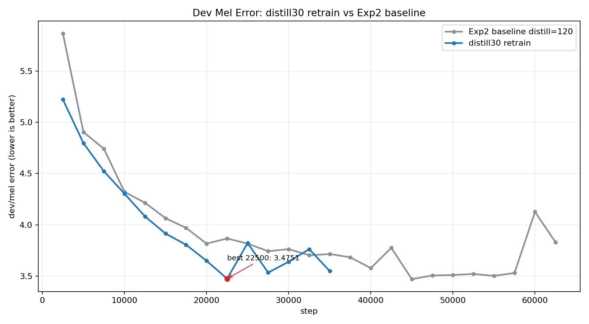
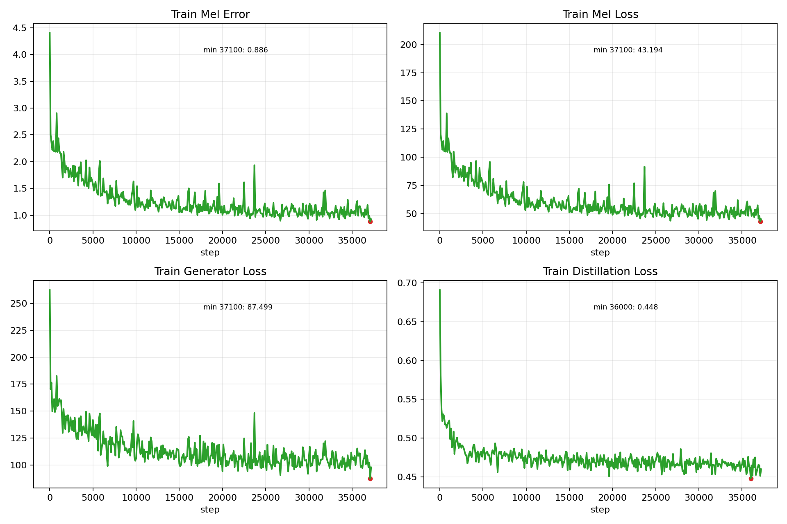
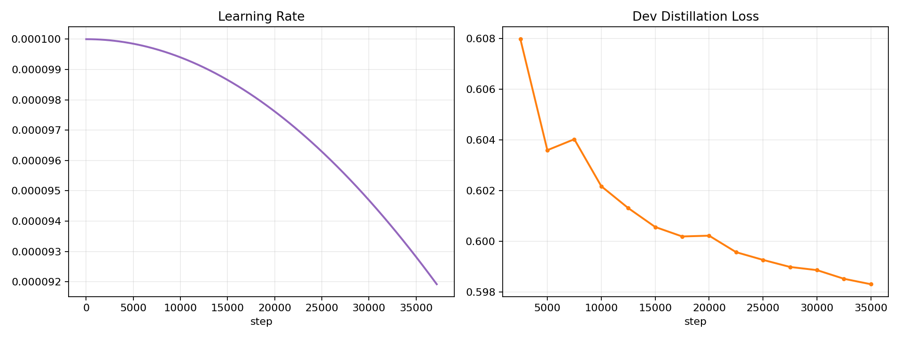

# ??????

- run_id: `exp2_scit_speech_distill30_retrain_20260528_seed42`
- ??????? TensorBoard event ??????????????

## ???

## ????

- ?? dev/mel ???step 22500?value=3.475089
- ?? dev/mel?step 35000?value=3.549350
- ?? train/mel error?step 37200?value=0.926462
- ?? learning rate?step 37200?value=0.00009192

